# Instrument ERD

This ERD is for AI-assisted implementation of the first product slice described
in `docs/PRD.md`. It models Instrument as a Postgres-backed app on InsForge
that persists durable workflow state, evidence, audit history, generated
actions, and integration health while leaving GitHub, Datadog, and TrueFoundry
as external systems of record.

## Sources Read

- `docs/PRD.md`
- `design/README.md`
- `design/project/console/app.jsx`
- `design/project/console/views.jsx`
- `design/project/console/incidents.jsx`
- `design/project/console/ui.jsx`
- `design/project/console/data.jsx`
- `design/project/auth.jsx`
- TrueFoundry MCP Gateway docs: https://www.truefoundry.com/docs/ai-gateway/mcp/mcp-overview
- TrueFoundry model metrics API docs: https://www.truefoundry.com/docs/ai-gateway/fetch-model-metrics
- TrueFoundry MCP metrics API docs: https://www.truefoundry.com/docs/ai-gateway/fetch-mcp-metrics
- TrueFoundry request logs API docs: https://www.truefoundry.com/docs/ai-gateway/fetch-request-logs
- TrueFoundry AI Gateway quick start: https://www.truefoundry.com/docs/ai-gateway/quick-start
- TrueFoundry Responses API docs: https://www.truefoundry.com/docs/ai-gateway/responses-api
- TrueFoundry deploy MCP server from code docs: https://www.truefoundry.com/docs/mcp-server-deployment/deploy-mcp-server-from-code
- GitHub MCP server: https://github.com/github/github-mcp-server
- Datadog MCP server: https://docs.datadoghq.com/mcp_server/
- Datadog MCP setup: https://docs.datadoghq.com/bits_ai/mcp_server/setup/
- Datadog MCP tools: https://docs.datadoghq.com/mcp_server/tools/
- Datadog webhooks: https://docs.datadoghq.com/integrations/webhooks/
- GitHub webhook payloads: https://docs.github.com/en/webhooks/webhook-events-and-payloads
- GitHub webhook signature validation: https://docs.github.com/en/webhooks/using-webhooks/validating-webhook-deliveries
- InsForge CLI skill and local `AGENTS.md` instructions

## Research-Driven Integration Assumptions

- TrueFoundry MCP Gateway should be the app's governed MCP access layer for
  GitHub MCP, Datadog MCP, and an Instrument-owned TrueFoundry observability MCP
  server. Store only gateway/server identifiers, tool invocations, redacted
  inputs, redacted summaries, and evidence references. Do not store raw OAuth
  tokens or provider keys.
- TrueFoundry AI Gateway should be the only path for LLM calls. Store
  `response_id`, model/provider names, schema version, trace/span IDs, usage,
  latency, validation state, and redacted output summaries.
- TrueFoundry model and MCP metrics are fetched from
  `POST /api/svc/v1/llm-gateway/metrics/query` with datasource
  `modelMetrics` or `mcpMetrics`. Persist the query envelope and result snapshot
  as `evidence_items` when the metric output is used as incident or
  recommendation evidence.
- TrueFoundry request logs are fetched through the spans query API
  `POST /api/svc/v1/spans/query`. Persist relevant spans as evidence snapshots,
  keyed by trace/span/request IDs.
- Deploy an Instrument-owned HTTP MCP server on TrueFoundry, preferably with
  Python and FastMCP, to expose bounded read-only tools for TrueFoundry model
  metrics, MCP metrics, request logs, and evidence-bundle lookup. Register that
  server with TrueFoundry MCP Gateway and pass its `integration_fqn` to the
  TrueFoundry Agent API along with GitHub and Datadog MCP servers.
- GitHub MCP supports toolsets such as `repos`, `pull_requests`, `issues`,
  `git`, and tool-level controls. Relevant tools include repository/file reads,
  PR diff/file/review-comment reads, `add_comment_to_pending_review`,
  `pull_request_review_write`, `create_branch`, `create_or_update_file`, and
  `create_pull_request`.
- Datadog MCP provides core tools for logs, metrics, monitors, incidents,
  services, spans, traces, dashboards, events, and notebooks; alerting tools
  include monitor validation, monitor coverage, templates, and
  `create_datadog_monitor`.
- Important Datadog MCP caveat: `create_datadog_monitor` creates a draft monitor
  that does not send notifications. The ERD supports draft and published states.
  For the first product slice, accepted Datadog alert recommendations create
  draft monitors only; publishing actively notifying monitors is later product
  scope.
- Datadog remains the source of truth for monitor state, alert state, logs,
  metrics, traces, service ownership, criticality, and notification routing.
- GitHub remains the source of truth for repository, commit, branch, PR, review,
  and comment state.
- InsForge provides Postgres, auth (`auth.users`), RLS, edge functions, storage,
  schedules, and frontend deployments. Use migrations for schema and RLS. Use
  server-only secrets/env vars for provider credentials.

## Modeling Principles

- Every user-owned table has `workspace_id` even though the first product slice
  has one workspace. This keeps RLS simple without requiring parent-join
  policies during the first-slice build.
- Store external IDs and cached snapshots, not authoritative copies of external
  systems.
- Store every AI conclusion with evidence references and schema validation
  status before showing it in the console or posting it externally.
- Store every external write in `external_write_actions`. Automatic GitHub PR
  review comments do not require human approval, but they still require audit and
  idempotency.
- Keep the custom TrueFoundry observability MCP server and Agent API MCP tool
  loop as first-class first-slice architecture. They are part of the product
  validation story, not later product scope.
- Use durable `jobs` for all long-running work. Store the first product slice's
  named phases and retry-attempt summaries in bounded `jsonb` arrays on `jobs`
  instead of separate `job_phases` and `job_attempts` tables.
- Use `jsonb` for provider-specific payloads, redacted request/response
  summaries, UI-ready child collections, and configuration diffs where external
  schemas are too unstable or too time-expensive to normalize for the first
  product slice.
- Normalize only the records that need independent idempotency, audit, approval,
  or cross-workflow lookup. For the first product slice, this keeps MCP/tool
  calls, model calls, evidence, external writes, jobs, webhooks,
  recommendations, incidents, and generated GitHub/Datadog artifacts first-class
  while collapsing display-only child rows into their parent records.

## Implementation Architecture

- Frontend: Vite React TypeScript SPA using Tailwind CSS 3.4, `@insforge/sdk`,
  and Phosphor icons via `@phosphor-icons/react`. The exported design prototype
  includes a self-contained inline SVG icon layer at
  `design/project/assets/icons.js` for portability; production implementation
  should use Phosphor while matching the prototype's icon choices, weight, and
  sizing. Deploy through InsForge frontend deployments.
- Backend/data plane: InsForge Postgres, Auth, RLS, Edge Functions, schedules,
  and server-side secrets. Browser code uses the InsForge anon key with RLS;
  webhook handlers, job workers, and external write executors use server-only
  InsForge credentials.
- Primary server functions: GitHub webhook ingestion, Datadog webhook ingestion,
  job worker/dispatcher, external action executor, and UI read APIs for
  dashboard/detail views.
- LLM orchestration: TrueFoundry Agent API for tool-using workflows. Attach
  GitHub MCP, Datadog MCP, and Instrument observability MCP servers by
  `integration_fqn` with explicit tool allowlists and bounded iteration limits.
  For the Instrument observability MCP server, pass run context such as
  `job_id`, `ai_model_call_id`, workspace, environment, and trace hints as
  explicit tool arguments whenever the tool needs that context. Do not rely on
  Agent API MCP headers for per-run metadata unless TrueFoundry confirms header
  forwarding semantics. Set `x-tfy-metadata` on Agent API requests for gateway
  routing, metrics, logs, and filtering only; it is not expected to propagate to
  MCP servers. Use TrueFoundry Responses API only for non-tool structured calls.
- Custom MCP service: deploy an Instrument-owned HTTP MCP server on TrueFoundry,
  preferably Python + FastMCP. Register it with TrueFoundry MCP Gateway and
  expose only bounded read-only tools for TrueFoundry model metrics, MCP
  metrics, request logs, trace spans, and existing evidence bundles.
- External systems of record: GitHub remains authoritative for repos, commits,
  PRs, review comments, and generated PRs. Datadog remains authoritative for
  monitors, logs, metrics, traces, incidents, and alert state. TrueFoundry
  remains authoritative for gateway traces, model/MCP metrics, request logs, and
  deployed MCP service status.
- UI updates: start with simple polling against app read endpoints and
  `app_events`, roughly once per second while active work is visible. Add
  InsForge realtime only if polling becomes too noisy.

## Conceptual ERD

```mermaid
erDiagram
  AUTH_USERS ||--o{ WORKSPACE_MEMBERS : belongs_to
  WORKSPACES ||--o{ WORKSPACE_MEMBERS : has
  WORKSPACES ||--|| WORKSPACE_SETTINGS : configures
  WORKSPACES ||--o{ INTEGRATIONS : has
  INTEGRATIONS ||--o{ MCP_SERVERS : exposes
  MCP_SERVERS ||--o{ MCP_TOOL_INVOCATIONS : executes

  WORKSPACES ||--o{ SERVICES : owns
  WORKSPACES ||--o{ REPOSITORIES : owns
  REPOSITORIES ||--o{ REPOSITORY_SERVICE_PATHS : maps
  SERVICES ||--o{ REPOSITORY_SERVICE_PATHS : maps

  REPOSITORIES ||--o{ GITHUB_PULL_REQUESTS : has
  GITHUB_PULL_REQUESTS ||--o{ GITHUB_PR_FILES : changes
  GITHUB_PULL_REQUESTS ||--o{ PR_REVIEW_RUNS : analyzed_by
  GITHUB_PULL_REQUESTS ||--o{ PR_REVIEW_FINDINGS : has
  PR_REVIEW_FINDINGS ||--o{ PR_REVIEW_COMMENTS : posts
  PR_REVIEW_RUNS ||--o{ PR_REVIEW_COMMENTS : places

  WORKSPACES ||--o{ INBOUND_WEBHOOKS : receives
  INBOUND_WEBHOOKS ||--o{ DATADOG_ALERT_EVENTS : normalizes
  WORKSPACES ||--o{ JOBS : runs
  JOBS ||--o{ JOB_AUDIT_EVENTS : audits
  JOBS ||--o{ MCP_TOOL_INVOCATIONS : calls
  JOBS ||--o{ AI_MODEL_CALLS : prompts
  AI_MODEL_CALLS ||--o{ MCP_TOOL_INVOCATIONS : selects
  JOBS ||--o{ EXTERNAL_WRITE_ACTIONS : performs
  MCP_TOOL_INVOCATIONS ||--o{ EVIDENCE_ITEMS : produces

  REPOSITORIES ||--o{ SCANS : scanned_by
  JOBS ||--o{ SCANS : backs
  SCANS ||--o{ RECOMMENDATIONS : produces
  RECOMMENDATIONS ||--o{ RECOMMENDATION_EVENTS : changes
  RECOMMENDATIONS ||--o{ GENERATED_PULL_REQUESTS : may_open
  RECOMMENDATIONS ||--o{ GENERATED_DATADOG_MONITORS : may_create
  RECOMMENDATIONS ||--o{ EVIDENCE_ITEMS : cites

  INTEGRATIONS ||--o{ DATADOG_MONITORS : caches
  DATADOG_MONITORS ||--o{ INCIDENTS : triggers
  DATADOG_MONITORS ||--o{ GENERATED_DATADOG_MONITORS : source_or_result

  SERVICES ||--o{ INCIDENTS : affected_by
  INBOUND_WEBHOOKS ||--o{ INCIDENTS : creates_or_updates
  DATADOG_ALERT_EVENTS ||--o{ INCIDENTS : updates
  INCIDENTS ||--o{ EVIDENCE_ITEMS : cites
  JOBS ||--o{ TELEMETRY_EMISSIONS : emits

  WORKSPACES ||--o{ EVIDENCE_ITEMS : stores
  JOBS ||--o{ EVIDENCE_ITEMS : collects
  AI_MODEL_CALLS ||--o{ EVIDENCE_ITEMS : cites

  WORKSPACES ||--o{ APPROVALS : requires
  APPROVALS ||--o{ EXTERNAL_WRITE_ACTIONS : authorizes
  WORKSPACES ||--o{ APP_EVENTS : notifies
```



## Proposed Postgres Enums and JSON Vocabularies

Create Postgres enums only for values stored in typed columns. Values used only
inside bounded `jsonb` arrays are listed as JSON vocabularies below; they do not
need first-pass database enum migrations for the first product slice.

- `integration_provider`: `github`, `datadog`, `truefoundry`
- `integration_status`: `connected`, `disconnected`, `degraded`,
  `rate_limited`, `missing_credentials`
- `mcp_server_role`: `external_provider`, `instrument_observability`
- `investigation_start_mode`: `manual`, `auto`, `smart`
- `job_type`: `github_pr_review_analysis`, `proactive_scan`,
  `recommendation_generation`, `datadog_monitor_analysis`,
  `datadog_alert_generation`, `incident_investigation`,
  `recommendation_pr_generation`, `truefoundry_metrics_ingest`,
  `truefoundry_logs_ingest`
- `job_state`: `queued`, `running`, `retrying`, `failed`, `succeeded`,
  `cancelled`
- `webhook_auth_method`: `github_signature`, `shared_secret_header`,
  `custom_hmac`, `none`
- `recommendation_category`: `instrumentation`, `alert`, `pr_review`
- `recommendation_state`: `active`, `accepted`, `dismissed`, `outdated`
- `alert_state`: `firing`, `resolved`
- `incident_state`: `active`, `resolved`
- `confidence_level`: `high`, `likely`, `low`
- `evidence_source_type`: `code_file`, `pr_diff`, `commit`,
  `datadog_monitor`, `datadog_metric`, `datadog_log`, `datadog_trace`,
  `datadog_dashboard`, `datadog_alert_event`, `truefoundry_log`,
  `truefoundry_metric`, `mcp_tool_call`, `ai_model_call`, `webhook_payload`
- `evidence_verification_state`: `verified`, `stale`, `unavailable`
- `approval_state`: `requested`, `approved`, `rejected`, `revoked`, `executed`
- `external_action_state`: `planned`, `running`, `succeeded`, `failed`,
  `skipped_duplicate`

JSON vocabularies:

- `job_phase_state`: `pending`, `running`, `retrying`, `succeeded`, `failed`,
  `skipped`
- `recommendation_step_kind`: `code_pr`, `datadog_new_monitor`,
  `datadog_monitor_change`, `dashboard_panel`, `manual_check`,
  `pr_review_record`
- `recommendation_step_state`: `locked`, `available`, `generating`, `ready`,
  `done`, `failed`, `skipped`
- `metric_existence_state`: `verified_in_datadog`, `expected_after_step`,
  `unverified`
- `step_completion_source`: `generated_pr_merged`, `datadog_monitor_created`,
  `external_monitor_change`, `manual_mark`, `pr_review_recorded`,
  `dashboard_panel_added`
- `incident_root_cause_type`: `code`, `runtime_config`, `upstream`, `unknown`

## Core Workspace and Auth Tables

### `workspaces`

Single-row in the first product slice, but all app tables should still reference it.

| Column | Type | Notes |
| --- | --- | --- |
| `id` | `uuid pk` | |
| `slug` | `text unique not null` | Stable configured workspace slug. |
| `name` | `text not null` | Console display name. |
| `primary_repository_id` | `uuid fk repositories.id null` | Filled after repository seed/link. |
| `created_at`, `updated_at` | `timestamptz` | |

### `workspace_members`

References InsForge auth users.

| Column | Type | Notes |
| --- | --- | --- |
| `workspace_id` | `uuid fk workspaces.id` | |
| `user_id` | `uuid fk auth.users.id` | |
| `role` | `text` | Demo can use `owner`; future roles can expand. |
| `created_at` | `timestamptz` | |

Primary key: `(workspace_id, user_id)`.

### `workspace_settings`

| Column | Type | Notes |
| --- | --- | --- |
| `workspace_id` | `uuid pk fk workspaces.id` | |
| `investigation_start_mode` | `investigation_start_mode not null default 'manual'` | UI labels: Manual, Automatic, Let Instrument decide. |
| `smart_start_rules` | `jsonb not null default '{}'` | Optional deterministic keyword/tag rule if smart auto-start needs stricter first-slice behavior later. |
| `primary_branch_scan_cooldown_seconds` | `integer not null default 30` | Short first-slice cooldown for coalescing primary-branch proactive scans. |
| `pr_review_enabled` | `boolean not null default true` | Enables automatic scoped PR comments. |
| `updated_by` | `uuid fk auth.users.id null` | |
| `updated_at` | `timestamptz not null` | |

## Integration and Gateway Tables

### `integrations`

Represents configured GitHub, Datadog, and TrueFoundry integration state.

| Column | Type | Notes |
| --- | --- | --- |
| `id` | `uuid pk` | |
| `workspace_id` | `uuid fk workspaces.id` | |
| `provider` | `integration_provider not null` | One each for the first product slice. |
| `status` | `integration_status not null` | Drives Integrations view. |
| `display_name` | `text not null` | `GitHub`, `Datadog`, `TrueFoundry`. |
| `external_account_id` | `text null` | GitHub org/user, Datadog org/site, TrueFoundry tenant/account. |
| `config` | `jsonb not null default '{}'` | Non-secret config: owner, repo allowlist, Datadog site, gateway URL names, toolsets. |
| `secret_ref` | `text null` | Name/path in InsForge secrets/deployment env, never raw secret. |
| `last_checked_at` | `timestamptz null` | |
| `last_error_code` | `text null` | Redacted. |
| `last_error_summary` | `text null` | Redacted, UI-safe. |
| `created_at`, `updated_at` | `timestamptz` | |

Unique: `(workspace_id, provider)`.

For the first product slice, `integrations` stores current connection health
directly. If historical health becomes important later, add an
`integration_status_events` history table; do not build it for the first-slice
path.

### `mcp_servers`

Configured MCP servers as seen through TrueFoundry MCP Gateway.
Instrument's tool-using LLM workflows call the TrueFoundry Agent API. For
registered MCP servers, pass `integration_fqn` entries in the Agent API
`mcp_servers` array with `enable_all_tools = false` and an explicit tool
allowlist. Register three MCP servers for the first product slice: GitHub MCP,
Datadog MCP, and the Instrument-owned TrueFoundry observability MCP server. Keep
the copied MCP server URL for diagnostics and any deterministic direct MCP
client calls.

| Column | Type | Notes |
| --- | --- | --- |
| `id` | `uuid pk` | |
| `workspace_id` | `uuid fk workspaces.id` | |
| `integration_id` | `uuid fk integrations.id` | Provider integration exposed through this MCP server: GitHub, Datadog, or TrueFoundry for the Instrument observability MCP server. |
| `gateway_integration_id` | `uuid fk integrations.id` | TrueFoundry integration used as the MCP gateway. |
| `server_role` | `mcp_server_role not null default 'external_provider'` | `instrument_observability` for the custom TrueFoundry metrics/logs MCP server. |
| `integration_fqn` | `text not null` | TrueFoundry registered MCP server FQN used in Agent API `mcp_servers` entries. |
| `mcp_server_url` | `text null` | Copied TrueFoundry MCP server URL for diagnostics or direct MCP client calls. |
| `gateway_server_name` | `text not null` | Human-readable TrueFoundry registered MCP server name from the gateway UI; useful for display and diagnostics, not necessarily callable by itself. |
| `gateway_integration_id_value` | `text null` | URL path identifier in `/api/llm/mcp/<integration-id>/server`, when known. This is the identifier embedded in `mcp_server_url`. |
| `provider_server_name` | `text not null` | Example: `github`, `datadog`, `instrument_truefoundry_observability`. |
| `transport` | `text not null` | Usually `streamable_http` through gateway. |
| `inbound_auth_mode` | `text null` | TrueFoundry gateway auth mode: `PAT`, `VAT`, IdP token, etc. |
| `outbound_auth_mode` | `text null` | Provider auth mode configured in the gateway. |
| `toolsets` | `text[] not null default '{}'` | GitHub: `repos`, `pull_requests`, `git`; Datadog: `core`, `alerting`, `apm`; Instrument: `truefoundry_observability`. |
| `enabled_tools` | `text[] null` | Explicit Agent API allowlist. Instrument tools should include only bounded read-only metric/log/evidence tools. |
| `write_tools_enabled` | `boolean not null default false` | True only when governance allows provider writes. |
| `status` | `integration_status not null` | |
| `last_discovered_at` | `timestamptz null` | Last successful tool discovery. |
| `created_at`, `updated_at` | `timestamptz` | |

Unique: `(workspace_id, integration_fqn)`.
Unique: `(workspace_id, gateway_server_name)`.

Instrument observability MCP server tool contract:

- `query_truefoundry_model_metrics`: read-only; accepts approved time window,
  job/workflow IDs, provider/model filters, and aggregation template names.
- `query_truefoundry_mcp_metrics`: read-only; accepts approved time window,
  MCP server/tool filters, job/workflow IDs, and aggregation template names.
- `search_truefoundry_request_logs`: read-only; accepts approved time window,
  trace/request/job IDs, error/rate-limit filters, and bounded result limits.
- `get_truefoundry_trace_spans`: read-only; accepts trace ID plus optional span
  type/name filters.
- `get_instrument_evidence_bundle`: read-only; accepts job, incident,
  recommendation, or evidence IDs and returns compact evidence summaries.

Each Instrument observability tool must enforce allowlisted query templates,
bounded time windows, redaction, and result-size limits. Tools should only
return compact structured results; they should not write to InsForge directly.
The Agent API caller/job worker consumes streamed tool call and tool result
events, then persists `mcp_tool_invocations` and any cited TrueFoundry metric,
log, or span snapshots as `evidence_items`. Pass job and agent-context
identifiers to the custom MCP server as explicit tool arguments. Headers such as
`mcp_servers[].headers` or `x-tfy-mcp-headers` may be used for authentication or
future confirmed pass-through behavior, but the first product slice should not depend on them
for metadata propagation. If context is unavailable, correlate with
TrueFoundry trace/request IDs and the enclosing `ai_model_calls` row.

Starter query templates for the first product slice:

- `last_15m_by_job`: model/MCP errors, retries, latency, and request counts
  filtered by Instrument job/workflow metadata.
- `last_1h_by_trace`: request logs and spans around a known trace or request ID.
- `mcp_tool_latency_by_server`: p95/p99 latency and error count grouped by MCP
  server and tool name.
- `model_errors_by_provider`: model error/rate-limit counts grouped by provider
  and model.
- `request_logs_for_trace`: bounded request-log excerpts for a trace/request
  identifier.

### `mcp_tool_invocations`

Audit and evidence spine for MCP calls via TrueFoundry Gateway.

| Column | Type | Notes |
| --- | --- | --- |
| `id` | `uuid pk` | |
| `workspace_id` | `uuid fk workspaces.id` | |
| `mcp_server_id` | `uuid fk mcp_servers.id` | |
| `job_id` | `uuid fk jobs.id null` | Null only for health checks. |
| `ai_model_call_id` | `uuid fk ai_model_calls.id null` | Set for tools selected during a TrueFoundry Agent API call. |
| `agent_tool_call_id` | `text null` | Optional streamed Agent API tool call ID when present; do not rely on this being provided by the API. |
| `agent_stream_event_index` | `integer null` | Fallback sequence number assigned by the job worker while parsing the Agent API stream. |
| `tool_name` | `text not null` | Exact MCP tool name. |
| `purpose` | `text not null` | Example: `pr_diff_read`, `monitor_coverage`, `post_review_comment`. |
| `idempotency_key` | `text null` | Required for external writes. |
| `arguments_redacted` | `jsonb not null default '{}'` | No secrets. |
| `response_summary` | `jsonb not null default '{}'` | UI/evidence-safe summary. |
| `status` | `text not null` | `succeeded`, `failed`, `rate_limited`, etc. |
| `error_code` | `text null` | |
| `latency_ms` | `integer null` | |
| `truefoundry_trace_id` | `text null` | Correlates with TF request logs. |
| `truefoundry_span_id` | `text null` | |
| `truefoundry_request_id` | `text null` | Gateway request/tool-call identifier when provided. |
| `integration_status_snapshot` | `jsonb null` | Compact status/error snapshot for 429/5xx failures; current health still lives on `integrations`. |
| `started_at`, `completed_at` | `timestamptz` | |

The canonical logical write idempotency key lives on `external_write_actions`.
When a write is executed through MCP, `mcp_tool_invocations.idempotency_key` must
use the exact same value. Keep the partial unique index
`(mcp_server_id, tool_name, idempotency_key)` where `idempotency_key is not null`
as a provider-call guard, not as an independent key-generation scheme.

## Service, Repository, and GitHub Tables

### `services`

Service catalog row used by incidents, recommendations, and code mapping.

| Column | Type | Notes |
| --- | --- | --- |
| `id` | `uuid pk` | |
| `workspace_id` | `uuid fk workspaces.id` | |
| `name` | `text not null` | Example: `payments-api`. |
| `environment` | `text not null default 'production'` | |
| `datadog_service_id` | `text null` | If Datadog provides one. |
| `datadog_service_name` | `text null` | |
| `owner_from_datadog` | `text null` | Must remain null when absent. |
| `criticality_from_datadog` | `text null` | Must remain null when absent. |
| `notification_routing_from_datadog` | `jsonb null` | Must remain null when absent. |
| `metadata_source` | `text null` | Example: `datadog_service_catalog`. |
| `last_synced_at` | `timestamptz null` | |
| `created_at`, `updated_at` | `timestamptz` | |

Unique: `(workspace_id, name, environment)`.

### `repositories`

| Column | Type | Notes |
| --- | --- | --- |
| `id` | `uuid pk` | |
| `workspace_id` | `uuid fk workspaces.id` | |
| `integration_id` | `uuid fk integrations.id` | GitHub integration. |
| `github_owner` | `text not null` | |
| `github_name` | `text not null` | |
| `external_repo_id` | `text null` | GitHub repository ID. |
| `default_branch` | `text not null default 'main'` | |
| `clone_url` | `text null` | |
| `html_url` | `text null` | |
| `is_primary` | `boolean not null default false` | Demo primary repo. |
| `pr_review_enabled` | `boolean not null default true` | Scoped automatic comments. |
| `last_synced_at` | `timestamptz null` | |
| `created_at`, `updated_at` | `timestamptz` | |

Unique: `(workspace_id, github_owner, github_name)`.

### `repository_service_paths`

Maps code paths to services for recommendations and incident correlation.

| Column | Type | Notes |
| --- | --- | --- |
| `id` | `uuid pk` | |
| `repository_id` | `uuid fk repositories.id` | |
| `service_id` | `uuid fk services.id` | |
| `path_glob` | `text not null` | Example: `payments-api/**`. |
| `confidence` | `confidence_level null` | |
| `source` | `text not null` | `manual_config`, `datadog_service_catalog`, `ai_inferred`. |
| `created_at`, `updated_at` | `timestamptz` | |

### `github_pull_requests`

Cached PR metadata needed for dedupe and console records.

| Column | Type | Notes |
| --- | --- | --- |
| `id` | `uuid pk` | |
| `workspace_id` | `uuid fk workspaces.id` | Duplicated for direct RLS. |
| `repository_id` | `uuid fk repositories.id` | |
| `external_pr_number` | `integer not null` | |
| `external_node_id` | `text null` | |
| `title` | `text not null` | |
| `author_login` | `text null` | |
| `state` | `text not null` | `open`, `closed`, `merged`, etc. |
| `draft` | `boolean not null default false` | From the GitHub PR object; relevant to `ready_for_review`. |
| `base_branch` | `text not null` | |
| `head_branch` | `text not null` | |
| `head_sha` | `text not null` | |
| `html_url` | `text null` | |
| `opened_at`, `updated_at`, `closed_at`, `merged_at` | `timestamptz null` | |
| `last_synced_at` | `timestamptz null` | |

Unique: `(repository_id, external_pr_number)`.

Commit metadata used for deploy correlation is stored as `evidence_items`
(`source_type = 'commit'`) or inside `incidents.correlated_changes` for the
first product slice. GitHub remains the source of truth for full commit history,
so do not build a first-pass `github_commits` cache unless later workflows need
commit rows as independently addressable records.

### `github_push_events`

Normalized GitHub `push` webhook data used to trigger primary-branch scans. The
raw webhook stays in `inbound_webhooks.payload_redacted`; this table stores only
the fields needed for idempotency, cooldowns, and scan scope.

| Column | Type | Notes |
| --- | --- | --- |
| `id` | `uuid pk` | |
| `workspace_id` | `uuid fk workspaces.id` | |
| `repository_id` | `uuid fk repositories.id` | |
| `webhook_event_id` | `uuid fk inbound_webhooks.id` | |
| `ref` | `text not null` | Example: `refs/heads/main`. |
| `before_sha` | `text not null` | GitHub `before`. |
| `after_sha` | `text not null` | GitHub `after`. |
| `base_ref` | `text null` | GitHub `base_ref`, often null. |
| `compare_url` | `text null` | GitHub `compare` URL. |
| `created` | `boolean not null default false` | Whether the ref was created. |
| `deleted` | `boolean not null default false` | Whether the ref was deleted. |
| `forced` | `boolean not null default false` | Whether the push was forced. |
| `pusher_name` | `text null` | From `pusher`. |
| `commit_count` | `integer not null default 0` | Payload commits array length; GitHub caps the array. |
| `head_commit_sha` | `text null` | From `head_commit.id` when present. |
| `created_at` | `timestamptz not null` | |

Unique: `(repository_id, before_sha, after_sha, ref)`.

### `github_pr_files`

| Column | Type | Notes |
| --- | --- | --- |
| `id` | `uuid pk` | |
| `workspace_id` | `uuid fk workspaces.id` | Duplicated for direct RLS. |
| `pull_request_id` | `uuid fk github_pull_requests.id` | |
| `path` | `text not null` | |
| `status` | `text null` | added, modified, removed. |
| `additions`, `deletions` | `integer null` | |
| `patch_hash` | `text null` | Store hash, not necessarily full patch. |
| `patch_excerpt` | `text null` | Small UI-safe excerpt if needed. |
| `raw` | `jsonb not null default '{}'` | |

Unique: `(pull_request_id, path)`.

### `pr_review_runs`

One analysis run for a PR webhook event/revision.

| Column | Type | Notes |
| --- | --- | --- |
| `id` | `uuid pk` | |
| `workspace_id` | `uuid fk workspaces.id` | |
| `repository_id` | `uuid fk repositories.id` | |
| `pull_request_id` | `uuid fk github_pull_requests.id` | |
| `job_id` | `uuid fk jobs.id` | |
| `webhook_event_id` | `uuid fk inbound_webhooks.id null` | |
| `event_action` | `text not null` | `opened`, `reopened`, `synchronize`, `ready_for_review`. |
| `head_sha` | `text not null` | Revision analyzed. |
| `comment_count` | `integer not null default 0` | |
| `status` | `text not null` | `no_findings`, `posted`, `failed`. |
| `started_at`, `completed_at` | `timestamptz null` | |

Unique: `(pull_request_id, head_sha, event_action)`. A replayed webhook should
hydrate the same run instead of creating a new run with a different `job_id`.

### `pr_review_findings`

Stable semantic findings for PR review dedupe across revisions. A finding may
produce zero or more comments as line placement changes, but the finding itself
must remain stable while the unresolved observability gap is semantically the
same.

| Column | Type | Notes |
| --- | --- | --- |
| `id` | `uuid pk` | |
| `workspace_id` | `uuid fk workspaces.id` | |
| `pull_request_id` | `uuid fk github_pull_requests.id` | |
| `recommendation_id` | `uuid fk recommendations.id null` | Category `pr_review`. |
| `semantic_fingerprint` | `text not null` | Issue type + file/code anchor + proposed fix summary; excludes `head_sha` and raw line number. |
| `issue_type` | `text not null` | Example: `missing_latency_metric`. |
| `file_path` | `text not null` | |
| `code_anchor` | `text null` | Function, route, queue name, or normalized code context. |
| `first_seen_head_sha` | `text not null` | |
| `last_seen_head_sha` | `text not null` | |
| `status` | `text not null default 'open'` | `open`, `resolved`, `outdated`, `skipped_duplicate`. |
| `created_by_model_call_id` | `uuid fk ai_model_calls.id null` | AI output provenance. |
| `validated_schema_version` | `text not null` | Required before posting. |
| `created_at`, `updated_at` | `timestamptz` | |

Unique: `(pull_request_id, semantic_fingerprint)`.

### `pr_review_comments`

Tracks automatic GitHub review comments and their recommendation record.

| Column | Type | Notes |
| --- | --- | --- |
| `id` | `uuid pk` | |
| `workspace_id` | `uuid fk workspaces.id` | |
| `review_run_id` | `uuid fk pr_review_runs.id` | |
| `finding_id` | `uuid fk pr_review_findings.id` | Stable finding this comment represents. |
| `recommendation_id` | `uuid fk recommendations.id null` | Category `pr_review`. |
| `external_write_action_id` | `uuid fk external_write_actions.id null` | Direct audit link for SEC-5. |
| `external_comment_id` | `text null` | GitHub comment/review thread ID after posting. |
| `file_path` | `text not null` | Changed file. |
| `line_number` | `integer not null` | Changed line where suggestion applies. |
| `side` | `text not null default 'RIGHT'` | GitHub diff side. |
| `body` | `text not null` | Posted review feedback. |
| `suggested_code` | `text null` | Optional snippet. |
| `revision_fingerprint` | `text not null` | Per-revision placement fingerprint; may include `head_sha` and line. |
| `semantic_fingerprint` | `text not null` | Copy from finding for easier unique indexes and audits. |
| `created_by_model_call_id` | `uuid fk ai_model_calls.id null` | AI output provenance. |
| `validated_schema_version` | `text not null` | Required before posting. |
| `status` | `text not null` | `planned`, `posted`, `skipped_duplicate`, `outdated`, `resolved`. |
| `posted_at` | `timestamptz null` | |
| `outdated_at` | `timestamptz null` | |

Unique per-revision placement: `(review_run_id, revision_fingerprint)`.
Unique cross-revision posted finding:
`(finding_id)` where `status in ('posted','resolved')`. A new PR revision should
update `pr_review_findings.last_seen_head_sha`; it should not post a second
comment unless the semantic fingerprint, file, anchor, or suggested fix
materially changes.

## Inbound Webhooks

### `inbound_webhooks`

Use for GitHub PR events and Datadog alert webhooks. Verify signatures before
creating incidents or jobs.

| Column | Type | Notes |
| --- | --- | --- |
| `id` | `uuid pk` | |
| `workspace_id` | `uuid fk workspaces.id` | |
| `provider` | `integration_provider not null` | `github` or `datadog`. |
| `integration_id` | `uuid fk integrations.id null` | |
| `event_type` | `text not null` | `pull_request`, `push`, `monitor_alert`, etc. |
| `event_action` | `text null` | Provider action/state. |
| `external_delivery_id` | `text not null` | Provider delivery/event ID when available; for Datadog this may be a synthesized webhook delivery key. |
| `provider_correlation_key` | `text null` | Stable subject key such as Datadog alert/monitor transition key, separate from delivery ID. |
| `auth_method` | `webhook_auth_method not null` | Chosen verification method. |
| `signature_valid` | `boolean not null default false` | Must be true before processing. |
| `headers_redacted` | `jsonb not null default '{}'` | Store delivery/event/signature header names and non-secret values. |
| `payload_redacted` | `jsonb not null` | Preserve enough for replay/debug; no secrets. |
| `received_at` | `timestamptz not null` | |
| `processed_at` | `timestamptz null` | |
| `processing_status` | `text not null default 'received'` | `received`, `ignored`, `processed`, `failed`. |
| `error_summary` | `text null` | |

Unique: `(provider, external_delivery_id)`.
For GitHub, `external_delivery_id` must come from `X-GitHub-Delivery`,
`event_type` from `X-GitHub-Event`, and `auth_method` should be
`github_signature` using `X-Hub-Signature-256`.
For Datadog, define `external_delivery_id` during webhook setup from stable
payload variables plus transition timestamp or last-updated timestamp, because
Datadog webhooks do not provide a GitHub-style delivery UUID. Store the alert
grouping value separately in `provider_correlation_key`.

## Durable Job Tables

### `jobs`

Durable state for all long-running workflows.

| Column | Type | Notes |
| --- | --- | --- |
| `id` | `uuid pk` | |
| `workspace_id` | `uuid fk workspaces.id` | |
| `job_type` | `job_type not null` | |
| `state` | `job_state not null default 'queued'` | |
| `target_type` | `text not null` | Example: `incident`, `recommendation`, `pull_request`, `repository`. |
| `target_id` | `uuid not null` | Application-enforced polymorphic FK. |
| `target_step_key` | `text null` | Stable key inside `recommendations.steps` for step-level jobs. |
| `idempotency_key` | `text not null` | Prevent duplicate jobs on refresh/retry/webhook replay. |
| `created_by` | `uuid fk auth.users.id null` | Null for webhooks/system jobs. |
| `safe_to_retry` | `boolean not null default true` | Controls Retry button. |
| `attempt_count` | `integer not null default 0` | |
| `max_attempts` | `integer not null default 3` | |
| `retry_policy` | `jsonb not null default '{}'` | Backoff policy snapshot used by workers. |
| `phases` | `jsonb not null default '[]'` | Ordered UI-ready phase objects: key, label, state, retry note, timestamps. |
| `attempts` | `jsonb not null default '[]'` | Bounded attempt summaries: attempt number, state, worker, error, backoff. |
| `next_run_at` | `timestamptz null` | Backoff schedule. |
| `locked_by` | `text null` | Worker ID that currently owns the lease. |
| `locked_at` | `timestamptz null` | |
| `lease_expires_at` | `timestamptz null` | Reclaim job if worker dies. |
| `heartbeat_at` | `timestamptz null` | Updated by long-running workers. |
| `failure_integration_id` | `uuid fk integrations.id null` | Shows affected source. |
| `failure_source` | `text null` | `github`, `datadog`, `truefoundry`, `worker`. |
| `error_code` | `text null` | |
| `error_summary` | `text null` | Redacted. |
| `progress_version` | `integer not null default 1` | Helps UI refresh/poll. |
| `cancel_requested_at` | `timestamptz null` | Set when a supported job should stop. |
| `cancel_requested_by` | `uuid fk auth.users.id null` | |
| `cancel_reason` | `text null` | UI-safe reason. |
| `queued_at`, `started_at`, `completed_at` | `timestamptz null` | |
| `created_at`, `updated_at` | `timestamptz` | |

Unique: `(workspace_id, job_type, idempotency_key)`.
Workers must claim queued/retryable jobs transactionally using either these
lease columns or `select ... for update skip locked`. Lease expiry is required
so restart recovery does not create duplicate external writes or permanently
strand a running job.

Investigation display mapping:

- no job: `new`
- `queued`, `running`, `retrying`: `investigating`
- `succeeded`: `complete`
- terminal `failed`: `failed`
- `cancelled`: `failed` with cancellation copy, unless the target workflow has
  a more specific cancelled UI state.

`jobs.phases` replaces the earlier `job_phases` table for the first product slice. Example
phase object:

```json
{
  "key": "pull_observability_signals",
  "label": "Pulling observability signals",
  "state": "retrying",
  "retry_note": "TrueFoundry rate-limited the request. Retrying attempt 2 of 3.",
  "started_at": "2026-06-05T19:12:00Z",
  "completed_at": null
}
```

`jobs.attempts` replaces the earlier `job_attempts` table. Keep this array
bounded to the configured retry count and use `attempt_count`, `next_run_at`,
`error_code`, and `error_summary` for worker queries and list views.

### `job_audit_events`

Human-readable event log for what the job consulted or changed.

| Column | Type | Notes |
| --- | --- | --- |
| `id` | `uuid pk` | |
| `workspace_id` | `uuid fk workspaces.id` | Duplicated for direct RLS. |
| `job_id` | `uuid fk jobs.id` | |
| `integration_id` | `uuid fk integrations.id null` | |
| `event_type` | `text not null` | `source_read`, `retry_scheduled`, `external_write`, `schema_validated`. |
| `summary` | `text not null` | UI-safe. |
| `payload_redacted` | `jsonb not null default '{}'` | |
| `occurred_at` | `timestamptz not null` | |

## Scans and Recommendations

### `scans`

Proactive repository/observability scans.

| Column | Type | Notes |
| --- | --- | --- |
| `id` | `uuid pk` | |
| `workspace_id` | `uuid fk workspaces.id` | |
| `repository_id` | `uuid fk repositories.id` | |
| `job_id` | `uuid fk jobs.id` | |
| `github_push_event_id` | `uuid fk github_push_events.id null` | Source push event for primary-branch scans. |
| `trigger_source` | `text not null` | `primary_branch_commit`, `cooldown`, `system_seed`. |
| `trigger_commit_sha` | `text null` | |
| `trigger_commit_range` | `jsonb null` | For GitHub `push` events on the primary branch. |
| `cooldown_suppressed` | `boolean not null default false` | True when a push was recorded but scan was skipped due to cooldown. |
| `suppression_reason` | `text null` | UI/audit-safe explanation. |
| `service_scope` | `text[] null` | Optional service names. |
| `status` | `job_state not null` | Mirror job terminal/current state. |
| `fresh_until` | `timestamptz null` | Supports freshness/staleness display. |
| `started_at`, `completed_at` | `timestamptz null` | |

Unique idempotency suggestion: `(repository_id, trigger_source, trigger_commit_sha)`
where `trigger_commit_sha is not null`.

### `recommendations`

Proactive, alert, and PR-review recommendations.

| Column | Type | Notes |
| --- | --- | --- |
| `id` | `uuid pk` | |
| `workspace_id` | `uuid fk workspaces.id` | |
| `scan_id` | `uuid fk scans.id null` | Null for PR review findings. |
| `repository_id` | `uuid fk repositories.id null` | |
| `service_id` | `uuid fk services.id null` | |
| `category` | `recommendation_category not null` | `instrumentation`, `alert`, `pr_review`. |
| `state` | `recommendation_state not null default 'active'` | |
| `title` | `text not null` | |
| `rationale` | `text not null` | |
| `affected_code_path` | `text null` | |
| `affected_runtime_path` | `text null` | Endpoint, queue, job, dashboard panel, etc. |
| `proposed_next_step` | `text not null` | |
| `steps` | `jsonb not null default '[]'` | Ordered dependent step objects for the first product slice UI and workflow state. |
| `steps_schema_version` | `text not null default 'recommendation_steps.v1'` | Version for validating `steps` JSON. |
| `confidence` | `confidence_level null` | Optional for recs. |
| `dedupe_fingerprint` | `text not null` | Stable across scans for REC-7. |
| `context_hash` | `text null` | Code/monitor context used to detect staleness. |
| `created_by_model_call_id` | `uuid fk ai_model_calls.id null` | AI output provenance. |
| `validated_schema_version` | `text not null` | Required before display. |
| `outdated_reason` | `text null` | Required when state is `outdated`. |
| `last_seen_scan_id` | `uuid fk scans.id null` | Helps preserve stable recommendations. |
| `superseded_by_recommendation_id` | `uuid fk recommendations.id null` | New recommendation replacing an outdated one, if any. |
| `accepted_at`, `dismissed_at`, `outdated_at` | `timestamptz null` | |
| `created_at`, `updated_at` | `timestamptz` | |

Unique active dedupe: `(workspace_id, category, dedupe_fingerprint)` with app logic
to update `last_seen_scan_id` instead of creating duplicates.

`recommendations.steps` replaces the earlier `recommendation_steps` table for
the first product slice. Each step object should include:

- `key`: stable per-recommendation key, such as `add_queue_depth_metric`.
- `order`: 1-based display order.
- `kind`: one of the `recommendation_step_kind` JSON vocabulary values.
- `state`: one of the `recommendation_step_state` JSON vocabulary values.
- `required`: boolean; required steps must be complete before acceptance.
- `prerequisite_step_key`: nullable key that locks dependent steps.
- `label`, `target_provider`, and `proposed_payload`.
- `configuration_diff` for Datadog monitor-change review drawers.
- `verification_state`, `metric_name`, and `metric_evidence_id` for alert steps.
- `job_id`, `completion_source`, `completion_evidence_id`, `completed_by`, and
  `completed_at` when a step is in flight or done.

Acceptance rule: a recommendation becomes `accepted` only after all required
step objects are `done`; opening a PR is not enough unless the step is
explicitly a non-mutating/manual record. `datadog_monitor_change` is a
reviewable diff for the first product slice and should complete via `external_monitor_change`
or `manual_mark` unless the product scope is later expanded to let Instrument
mutate existing monitors.

### `recommendation_events`

Lifecycle history.

| Column | Type | Notes |
| --- | --- | --- |
| `id` | `uuid pk` | |
| `workspace_id` | `uuid fk workspaces.id` | Duplicated for direct RLS. |
| `recommendation_id` | `uuid fk recommendations.id` | |
| `from_state` | `recommendation_state null` | |
| `to_state` | `recommendation_state not null` | |
| `reason` | `text null` | Required for outdated/dismissed if available. |
| `actor_user_id` | `uuid fk auth.users.id null` | Null for system transitions. |
| `job_id` | `uuid fk jobs.id null` | |
| `occurred_at` | `timestamptz not null` | |

### `generated_pull_requests`

Generated PRs for approved code-based recommendation steps.

| Column | Type | Notes |
| --- | --- | --- |
| `id` | `uuid pk` | |
| `workspace_id` | `uuid fk workspaces.id` | Duplicated for direct RLS. |
| `recommendation_id` | `uuid fk recommendations.id` | |
| `step_key` | `text not null` | Stable key inside `recommendations.steps`. |
| `repository_id` | `uuid fk repositories.id` | |
| `github_pull_request_id` | `uuid fk github_pull_requests.id null` | Linked after the PR is opened/synced. |
| `job_id` | `uuid fk jobs.id` | |
| `approval_id` | `uuid fk approvals.id` | Required. |
| `branch_name` | `text not null` | Example: `instrument/payments-api-queue-depth-metric`. |
| `base_branch` | `text not null` | |
| `base_sha` | `text null` | Base revision used to draft the branch. |
| `branch_head_sha` | `text null` | Current generated branch head. |
| `commit_sha` | `text null` | Commit created by Instrument, if any. |
| `title` | `text not null` | |
| `summary` | `text not null` | |
| `changed_files` | `text[] not null default '{}'` | |
| `file_change_summaries` | `jsonb not null default '[]'` | Per-file hash/excerpt/write-state summaries for retry/audit. |
| `external_pr_number` | `integer null` | |
| `external_pr_id` | `text null` | |
| `html_url` | `text null` | |
| `state` | `text not null default 'planned'` | `planned`, `opened`, `merged`, `closed`, `stale`, `failed`. |
| `opened_at`, `merged_at`, `closed_at` | `timestamptz null` | |
| `created_at`, `updated_at` | `timestamptz` | |

Unique: `(repository_id, branch_name)`.
`generated_pull_requests.file_change_summaries` replaces the earlier
`generated_pr_file_changes` table. Store only UI-safe file path, change kind,
patch hash/excerpt, write state, and optional `external_write_action_id`.

### `generated_datadog_monitors`

Generated alert/monitor records for approved alert recommendation steps.

| Column | Type | Notes |
| --- | --- | --- |
| `id` | `uuid pk` | |
| `workspace_id` | `uuid fk workspaces.id` | Duplicated for direct RLS. |
| `recommendation_id` | `uuid fk recommendations.id` | |
| `step_key` | `text not null` | Stable key inside `recommendations.steps`. |
| `datadog_monitor_id` | `uuid fk datadog_monitors.id null` | Cached resulting monitor when synced. |
| `job_id` | `uuid fk jobs.id` | |
| `approval_id` | `uuid fk approvals.id` | Required. |
| `name` | `text not null` | |
| `query` | `text not null` | |
| `monitor_type` | `text not null` | |
| `thresholds` | `jsonb not null default '{}'` | |
| `tags` | `text[] not null default '{}'` | |
| `service_scope` | `text null` | |
| `notification_targets` | `text[] null` | Only when known from Datadog. |
| `external_monitor_id` | `text null` | |
| `datadog_url` | `text null` | |
| `external_state` | `text not null default 'planned'` | `planned`, `draft`, `published`, `failed`, `manually_published`. |
| `created_at`, `updated_at` | `timestamptz` | |

## Datadog Cache and Metric Verification

### `datadog_monitors`

Cached monitor config/status from Datadog.

| Column | Type | Notes |
| --- | --- | --- |
| `id` | `uuid pk` | |
| `workspace_id` | `uuid fk workspaces.id` | |
| `integration_id` | `uuid fk integrations.id` | Datadog integration. |
| `service_id` | `uuid fk services.id null` | App mapping when known. |
| `external_monitor_id` | `text not null` | Datadog monitor ID. |
| `name` | `text not null` | |
| `monitor_type` | `text null` | |
| `query` | `text null` | |
| `thresholds` | `jsonb null` | |
| `tags` | `text[] null` | |
| `status` | `text null` | Source status. |
| `priority` | `integer null` | |
| `notification_targets` | `text[] null` | Only if in config. |
| `runbook_url` | `text null` | Only if in config. |
| `raw` | `jsonb not null default '{}'` | Redacted monitor payload. |
| `last_synced_at` | `timestamptz not null` | |

Unique: `(workspace_id, external_monitor_id)`.

Metric existence and prerequisite tracking lives on
`recommendations.steps[].verification_state` plus linked `evidence_items` for
the first product slice. Add a normalized `observed_metrics` table later only if metric
inventory becomes a reusable product surface.

### `datadog_alert_events`

Normalized Datadog alert webhook events. This avoids treating webhook delivery
identity and alert correlation identity as the same thing.

| Column | Type | Notes |
| --- | --- | --- |
| `id` | `uuid pk` | |
| `workspace_id` | `uuid fk workspaces.id` | |
| `webhook_event_id` | `uuid fk inbound_webhooks.id` | |
| `datadog_monitor_id` | `uuid fk datadog_monitors.id null` | |
| `external_monitor_id` | `text null` | Present even before monitor cache is hydrated. |
| `alert_correlation_key` | `text not null` | Stable key for updating the current incident. |
| `alert_transition_key` | `text not null` | Alert key + transition/state timestamp for deduping retries. |
| `event_id` | `text null` | Datadog `$ID` event ID when provided. |
| `event_url` | `text null` | Datadog `$LINK` event URL when provided. |
| `alert_title` | `text null` | Datadog `$EVENT_TITLE` or monitor title. |
| `alert_message` | `text null` | Datadog `$TEXT_ONLY_MSG` or `$EVENT_MSG`. |
| `alert_query` | `text null` | Monitor query if included in the custom payload. |
| `alert_metric` | `text null` | Metric name/namespace if included. |
| `alert_scope` | `text null` | Datadog alert scope/group, if included. |
| `alert_transition` | `text not null` | Raw Datadog transition such as `Triggered`, `Recovered`, `No Data`, etc. |
| `alert_state` | `alert_state not null` | |
| `service_name` | `text null` | Raw or normalized service tag. |
| `tags` | `jsonb not null default '{}'` | Redacted Datadog tags. |
| `occurred_at` | `timestamptz not null` | Alert event time from Datadog `$DATE`. |
| `last_updated_at` | `timestamptz null` | Datadog `$LAST_UPDATED`, if provided. |
| `raw_summary` | `jsonb not null default '{}'` | Redacted bounded snapshot. |

Unique: `(workspace_id, alert_transition_key)`.
Recommended Datadog custom payload fields: `alert_id` from `$ALERT_ID`,
`alert_cycle_key` from `$ALERT_CYCLE_KEY`, `alert_transition` from
`$ALERT_TRANSITION`, `event_id` from `$ID`, `event_url` from `$LINK`,
`event_title` from `$EVENT_TITLE`, `event_msg` from `$TEXT_ONLY_MSG`,
`event_type` from `$EVENT_TYPE`, `date` from `$DATE`, `last_updated` from
`$LAST_UPDATED`, `tags` from `$TAGS`, and targeted tag values such as
`$TAGS[service]`, `$TAGS[env]`, and `$TAGS[instrument_demo]`. Map
`Triggered`, `Re-Triggered`, `Warn`, `Re-Warn`, `No Data`, `Re-No Data`, and
`Renotify` to `alert_state = 'firing'`; map `Recovered` to `resolved`.

## Incidents and Investigations

### `incidents`

Created/updated from authenticated Datadog alert webhooks.

| Column | Type | Notes |
| --- | --- | --- |
| `id` | `uuid pk` | |
| `workspace_id` | `uuid fk workspaces.id` | |
| `service_id` | `uuid fk services.id null` | |
| `datadog_monitor_id` | `uuid fk datadog_monitors.id null` | |
| `webhook_event_id` | `uuid fk inbound_webhooks.id null` | Creation/update source. |
| `datadog_alert_event_id` | `uuid fk datadog_alert_events.id null` | Normalized source alert event. |
| `caused_by_job_id` | `uuid fk jobs.id null` | Used for TF-4 reliability-proof link from induced incident to original PR-generation job. |
| `external_alert_key` | `text not null` | Datadog dedupe/alert key. |
| `incident_correlation_key` | `text not null` | Non-null key for "update current open incident" semantics. |
| `title` | `text not null` | |
| `description` | `text null` | |
| `source` | `text not null default 'Datadog monitor'` | |
| `alert_state` | `alert_state not null` | Source alert state. |
| `incident_state` | `incident_state not null default 'active'` | App incident visibility. |
| `investigation_job_id` | `uuid fk jobs.id null` | Current/last investigation. |
| `investigation_start_mode_snapshot` | `investigation_start_mode not null` | Captured at creation. |
| `started_automatically` | `boolean not null default false` | UI badge. |
| `signals` | `jsonb not null default '[]'` | Key signal objects for the side rail, with evidence IDs when available. |
| `timeline` | `jsonb not null default '[]'` | Ordered timeline events shown in incident detail. |
| `hypotheses` | `jsonb not null default '[]'` | Ranked validated RCA output with confidence and evidence IDs. |
| `correlated_changes` | `jsonb not null default '[]'` | Commit/PR/change pointers used for deploy correlation. |
| `started_at` | `timestamptz not null` | Alert start. |
| `resolved_at` | `timestamptz null` | |
| `created_at`, `updated_at` | `timestamptz` | |

Partial unique index for active incidents:
`(workspace_id, incident_correlation_key)` where `incident_state = 'active'`.
Do not rely on nullable `service_id` for uniqueness.

`incidents.signals`, `incidents.timeline`, `incidents.hypotheses`, and
`incidents.correlated_changes` replace the earlier incident child tables for the
first product slice. Keep each object compact, UI-safe, and evidence-backed via
embedded `evidence_id` or `evidence_ids` fields. `hypotheses` must still
validate against the incident output schema and include rank, title, reasoning,
confidence,
`root_cause_type`, `fixable_by_instrument`, `no_fix_reason` when needed, and
`suggested_next_step`.

### `telemetry_emissions`

Metrics/events Instrument emits about its own reliability, especially retry and
error telemetry used by the TrueFoundry/Datadog reliability proof.

| Column | Type | Notes |
| --- | --- | --- |
| `id` | `uuid pk` | |
| `workspace_id` | `uuid fk workspaces.id` | |
| `job_id` | `uuid fk jobs.id null` | |
| `attempt_number` | `integer null` | Mirrors the relevant entry in `jobs.attempts` when available. |
| `integration_id` | `uuid fk integrations.id null` | Source integration involved in the failure/retry. |
| `metric_name` | `text not null` | Example: `instrument.job.retry`. |
| `tags` | `jsonb not null default '{}'` | Must include service/environment/workflow/error tags needed for Datadog routing. Avoid raw `job_id` as a Datadog metric tag; correlate job IDs app-side using trace/request IDs and time windows. |
| `value` | `numeric not null default 1` | |
| `truefoundry_trace_id` | `text null` | |
| `truefoundry_request_id` | `text null` | |
| `datadog_monitor_id` | `uuid fk datadog_monitors.id null` | Monitor that fired from this telemetry, when known. |
| `incident_id` | `uuid fk incidents.id null` | Incident created from this telemetry, when known. |
| `emission_state` | `external_action_state not null default 'planned'` | |
| `emitted_at` | `timestamptz null` | |
| `created_at` | `timestamptz not null` | |

## Evidence and AI Output

### `evidence_items`

All evidence cited by recommendations, PR comments, and hypotheses.

| Column | Type | Notes |
| --- | --- | --- |
| `id` | `uuid pk` | |
| `workspace_id` | `uuid fk workspaces.id` | |
| `source_type` | `evidence_source_type not null` | |
| `source_provider` | `integration_provider null` | |
| `collected_by_job_id` | `uuid fk jobs.id null` | |
| `mcp_tool_invocation_id` | `uuid fk mcp_tool_invocations.id null` | |
| `ai_model_call_id` | `uuid fk ai_model_calls.id null` | Set when cited or produced by a model call. |
| `subject_type` | `text not null` | `recommendation`, `incident`, `pr_review_comment`, `job`, etc. |
| `subject_id` | `uuid not null` | App-enforced polymorphic subject. |
| `subject_key` | `text null` | Optional nested key, such as recommendation step key or hypothesis rank. |
| `claim_type` | `text not null default 'fact'` | `fact`, `inference_support`, `suggested_action_support`, `counter_evidence`. |
| `external_id` | `text null` | Commit SHA, monitor ID, trace ID, response ID, etc. |
| `uri` | `text null` | GitHub/Datadog/TrueFoundry URL if available. |
| `title` | `text not null` | Human-readable citation title. |
| `summary` | `text not null` | Evidence summary safe for UI. |
| `payload` | `jsonb not null default '{}'` | Redacted, bounded-size snapshot. |
| `content_hash` | `text not null` | Detect stale evidence. |
| `verification_state` | `evidence_verification_state not null default 'verified'` | |
| `observed_at` | `timestamptz null` | Time evidence was true in source system. |
| `collected_at` | `timestamptz not null` | |

Index: `(workspace_id, source_type, external_id)`.
Index: `(workspace_id, subject_type, subject_id)`.

`evidence_items` intentionally replaces the earlier `evidence_links`,
`truefoundry_metric_queries`, and `truefoundry_spans` tables for the first product slice. If
one external fact supports multiple subjects, duplicate a compact evidence item
or write a second item with the same `content_hash`; avoid building a many-to-
many evidence join until the product needs it. Store TrueFoundry metric query
envelopes, metric results, request-log excerpts, and span pointers in
`payload` with a `source_type` of `truefoundry_metric`, `truefoundry_log`, or
`datadog_trace` as appropriate.

### `ai_model_calls`

LLM calls through TrueFoundry AI Gateway only. Tool-using calls should use the
TrueFoundry Agent API; non-tool structured calls may use the Responses API.

| Column | Type | Notes |
| --- | --- | --- |
| `id` | `uuid pk` | |
| `workspace_id` | `uuid fk workspaces.id` | |
| `integration_id` | `uuid fk integrations.id` | TrueFoundry integration. |
| `job_id` | `uuid fk jobs.id` | |
| `purpose` | `text not null` | `recommendation_schema`, `incident_hypotheses`, `pr_comment_draft`, etc. |
| `api_surface` | `text not null` | `agent_chat_completions` or `responses`. |
| `truefoundry_response_id` | `text null` | TrueFoundry response/chat completion ID when returned. |
| `truefoundry_trace_id` | `text null` | |
| `truefoundry_span_id` | `text null` | |
| `gateway_base_url_name` | `text null` | Non-secret label, not raw secret. |
| `provider_name` | `text null` | `x-tfy-provider-name` value. |
| `model_name` | `text not null` | TrueFoundry model name. |
| `agent_iteration_limit` | `integer null` | Set for Agent API calls to bound tool loops. |
| `mcp_servers_requested` | `jsonb null` | Redacted Agent API `mcp_servers` request entries: FQNs, enabled tool names, no secrets. |
| `request_schema_version` | `text not null` | |
| `output_schema_version` | `text not null` | |
| `input_hash` | `text not null` | Avoid storing large prompts. |
| `output_redacted` | `jsonb null` | Validated structured output, redacted. |
| `validation_status` | `text not null` | `valid`, `invalid`, `not_applicable`. |
| `input_tokens`, `output_tokens`, `total_tokens` | `integer null` | |
| `cost_usd` | `numeric null` | |
| `latency_ms` | `integer null` | |
| `status` | `text not null` | `succeeded`, `failed`, `rate_limited`. |
| `error_code`, `error_summary` | `text null` | Redacted. |
| `started_at`, `completed_at` | `timestamptz` | |

## Approvals and External Writes

### `approvals`

Required for recommendation PR generation, Datadog alert creation, and other
external writes except automatic GitHub PR review comments.

| Column | Type | Notes |
| --- | --- | --- |
| `id` | `uuid pk` | |
| `workspace_id` | `uuid fk workspaces.id` | |
| `action_type` | `text not null` | `generate_recommendation_pr`, `create_datadog_monitor`, `mark_external_monitor_change`. |
| `target_type` | `text not null` | Usually `recommendation`. |
| `target_id` | `uuid not null` | |
| `target_step_key` | `text null` | Stable key inside `recommendations.steps` when approving a step action. |
| `requested_by` | `uuid fk auth.users.id null` | |
| `approved_by` | `uuid fk auth.users.id null` | |
| `state` | `approval_state not null default 'requested'` | |
| `approval_summary` | `text not null` | What human approved. |
| `approved_payload_hash` | `text null` | Hash of the exact redacted request/config the human approved. |
| `approval_version` | `integer not null default 1` | Increment if the proposed payload changes before approval. |
| `created_at`, `approved_at`, `executed_at` | `timestamptz null` | |

### `external_write_actions`

Every write to GitHub, Datadog, or TrueFoundry-managed MCP tools. This is the
main audit table for SEC-4/SEC-5.

| Column | Type | Notes |
| --- | --- | --- |
| `id` | `uuid pk` | |
| `workspace_id` | `uuid fk workspaces.id` | |
| `approval_id` | `uuid fk approvals.id null` | Null only for automatic GitHub PR review comments. |
| `job_id` | `uuid fk jobs.id null` | |
| `mcp_tool_invocation_id` | `uuid fk mcp_tool_invocations.id null` | If executed through MCP. |
| `provider` | `integration_provider not null` | |
| `action_kind` | `text not null` | `github_review_comment`, `github_create_branch`, `github_update_file`, `github_create_pr`, `datadog_create_monitor`. `datadog_publish_monitor` is later product scope. |
| `idempotency_key` | `text not null` | Required. |
| `target_summary` | `text not null` | UI-safe target. |
| `request_hash` | `text not null` | Must match `approvals.approved_payload_hash` for approval-gated actions. |
| `request_redacted` | `jsonb not null default '{}'` | |
| `response_summary` | `jsonb not null default '{}'` | |
| `external_id` | `text null` | PR number, comment ID, monitor ID. |
| `external_url` | `text null` | |
| `state` | `external_action_state not null default 'planned'` | |
| `started_at`, `completed_at` | `timestamptz null` | |
| `error_code`, `error_summary` | `text null` | |

Unique: `(workspace_id, provider, action_kind, idempotency_key)`.
Demo enforcement requirement: the external action executor must reject every
`external_write_actions` row except `github_review_comment` unless it references
an `approved` and unrevoked approval, and `request_hash` equals
`approvals.approved_payload_hash`. This prevents an approved preview from
drifting before execution. A database trigger can enforce the same invariant
later, but for the first product slice keep the rule in worker code to reduce migration and
trigger-debugging risk.

### `app_events`

Outbox/change-notification table for polling or InsForge realtime. Use this to
surface debounced UI changes without re-running jobs or requiring a refresh.

| Column | Type | Notes |
| --- | --- | --- |
| `id` | `uuid pk` | |
| `workspace_id` | `uuid fk workspaces.id` | |
| `topic` | `text not null` | `jobs`, `incidents`, `recommendations`, `integrations`, `pr_reviews`. |
| `subject_type` | `text not null` | Entity type changed. |
| `subject_id` | `uuid not null` | |
| `event_type` | `text not null` | `created`, `updated`, `state_changed`, `content_changed`. |
| `debounce_key` | `text null` | Collapse noisy alert storms or batch scans. |
| `payload_summary` | `jsonb not null default '{}'` | Small UI-safe summary. |
| `visible_after` | `timestamptz not null default now()` | Debounce/release time. |
| `created_at` | `timestamptz not null` | |

Index: `(workspace_id, topic, visible_after desc)`.

## Traceability to PRD Requirements

- PR observability review: `inbound_webhooks`, `github_pull_requests`,
  `github_pr_files`, `github_push_events`, `pr_review_runs`,
  `pr_review_findings`, `pr_review_comments`, `recommendations`,
  `external_write_actions`, and `mcp_tool_invocations`.
- Recommendation lifecycle and archive: `recommendations`,
  `recommendations.steps`, `recommendation_events`, `generated_pull_requests`,
  and `generated_datadog_monitors`.
- Multi-step dependent recommendations: `recommendations.steps[].order` and
  `recommendations.steps[].prerequisite_step_key`.
- Datadog alert recommendations: `datadog_monitors`,
  `recommendations.steps[].configuration_diff`,
  `recommendations.steps[].verification_state`, `generated_datadog_monitors`,
  `evidence_items`, and `approvals`.
- Datadog incident ingestion and investigation: `inbound_webhooks`, `incidents`,
  `datadog_alert_events`, `incidents.signals`, `incidents.timeline`,
  `incidents.hypotheses`, `incidents.correlated_changes`, `jobs`, and
  `evidence_items`.
- Durable progress/retry/failure states: `jobs.phases`, `jobs.attempts`,
  `jobs.progress_version`, and `job_audit_events`.
- Evidence and confidence: `evidence_items`, `ai_model_calls`, and
  `incidents.hypotheses`.
- Integration health: `integrations` and `mcp_servers`.
- TrueFoundry reliability proof: `jobs` in `retrying`, `jobs.attempts`,
  `telemetry_emissions`, `ai_model_calls`, `mcp_tool_invocations`,
  `incidents.signals`, and `evidence_items`.
- Live console updates and debouncing: `app_events` plus `jobs.progress_version`.

## RLS and Security Notes

- Enable RLS on all workspace-owned tables.
- Policy pattern for normal users:
  `exists (select 1 from workspace_members wm where wm.workspace_id = <table>.workspace_id and wm.user_id = auth.uid())`.
- Prefer carrying `workspace_id` directly on user-readable child tables,
  including PR review comments, generated artifacts, evidence, and app events.
  Display-only child collections live inside parent `jsonb` columns for the
  first product slice and inherit the parent's RLS.
- Background workers, webhook handlers, and scheduled jobs should run with an
  InsForge server/service role and must still write `workspace_id`.
- Never put provider tokens, API keys, Datadog application keys, webhook secrets,
  TrueFoundry PAT/VAT values, or InsForge admin keys in relational columns.
  Store only `secret_ref`, status, and redacted diagnostics.
- `inbound_webhooks.signature_valid` must be true before downstream incident/job
  creation.
- `external_write_actions.approval_id` must be non-null for mutating actions
  except `github_review_comment`. For the first product slice, enforce approval
  state and request-hash equality in the external action executor; add a
  database trigger later only if this flow needs stronger defense-in-depth.
- Automatic PR comments must be scoped by `repositories.pr_review_enabled`,
  workspace settings, and repository allowlist config.
- Webhook processing should only create incidents/jobs after signature or shared
  secret verification and under a transactional lock keyed by delivery ID or
  alert transition key.

## Suggested Indexes and Constraints

- `jobs(workspace_id, state, next_run_at, lease_expires_at)` for worker polling.
- `jobs(workspace_id, target_type, target_id, job_type)` for UI hydration.
- `jobs(workspace_id, target_type, target_id, target_step_key, job_type)` for
  step-level recommendation jobs when `target_step_key is not null`.
- `recommendations(workspace_id, state, category, updated_at desc)`.
- `recommendations(workspace_id, dedupe_fingerprint)`.
- `pr_review_findings(pull_request_id, semantic_fingerprint)` unique.
- `pr_review_comments(finding_id)` partial unique where `status in ('posted','resolved')`.
- `github_push_events(repository_id, before_sha, after_sha, ref)` unique.
- `generated_pull_requests(github_pull_request_id)`.
- `datadog_alert_events(workspace_id, alert_transition_key)` unique.
- `incidents(workspace_id, incident_state, started_at desc)`.
- `incidents(workspace_id, alert_state, updated_at desc)`.
- `incidents(workspace_id, incident_correlation_key)` partial unique where `incident_state = 'active'`.
- `evidence_items(workspace_id, subject_type, subject_id)`.
- `mcp_tool_invocations(workspace_id, truefoundry_trace_id)`.
- `ai_model_calls(workspace_id, truefoundry_response_id)`.
- `inbound_webhooks(provider, external_delivery_id)` unique.
- `external_write_actions(workspace_id, provider, action_kind, idempotency_key)`
  unique.
- `app_events(workspace_id, topic, visible_after desc)`.

## Manual Provisioning Required

The ERD assumes these are supplied outside the database:

- InsForge project is linked and configured for `instrument`.
- InsForge auth has one configured user and one workspace membership.
- InsForge server-side env/secrets include any required app/admin keys. Do not
  expose admin keys to the frontend.
- TrueFoundry account/tenant, control plane URL, gateway base URL, and an
  application-appropriate API key, preferably a VAT for deployed app code.
- TrueFoundry model provider account(s), model name(s), and
  `x-tfy-provider-name` value for AI Gateway calls.
- TrueFoundry deployment for the Instrument observability MCP server, preferably
  an HTTP Python/FastMCP service, with server-side secrets for TrueFoundry metric
  and request-log APIs. It returns tool results only; it does not need an
  InsForge service credential.
- TrueFoundry MCP Gateway registration for GitHub MCP, Datadog MCP, and the
  Instrument observability MCP server, with copied MCP server FQNs, copied MCP
  server URLs, allowed toolsets, and write-tool governance/approval policies.
- GitHub repository allowlist, webhook secret, and token/OAuth credentials
  capable of reading repos/PRs/diffs and posting scoped PR review comments.
  If recommendation PR generation is enabled, credentials also need branch/file
  write and PR create permissions.
- Datadog site, webhook shared-secret/custom-header configuration, and Datadog MCP auth.
  Datadog MCP needs `mcp_read` for reads and `mcp_write` plus resource-level
  permissions for draft monitor creation. Publishing notifying monitors is not
  in first-slice scope.
- The Datadog webhook template must include fields sufficient to synthesize
  `external_delivery_id`, `alert_transition_key`, and `alert_correlation_key`.
- Demo Datadog monitor(s) that trigger on Instrument/TrueFoundry retry/error
  telemetry, unless monitor publishing is implemented after human approval.
- Telemetry tags/attributes for the reliability proof, including service,
  environment, stable workflow name, integration source, error/rate-limit code,
  and trace/request IDs. Avoid raw job IDs as Datadog metric tags; use
  application-side correlation to set `incidents.caused_by_job_id`.

## Webhook Payload Alignment

### GitHub

The schema agrees with GitHub webhook delivery and payload structure:

- Delivery headers map to `inbound_webhooks`: `X-GitHub-Delivery` to
  `external_delivery_id`, `X-GitHub-Event` to `event_type`, and redacted
  signature/hook headers to `headers_redacted`.
- Signature verification uses `X-Hub-Signature-256` and sets
  `auth_method = 'github_signature'` plus `signature_valid = true` before any
  downstream row is created.
- `pull_request` payloads map to `github_pull_requests` using payload `number`,
  `pull_request` fields such as title/state/draft/base/head/URLs/timestamps,
  and payload `repository` and `sender` metadata.
- `pull_request` events for `opened`, `reopened`, `synchronize`, and
  `ready_for_review` create `pr_review_runs`; `closed`/merged payloads update
  generated PR and recommendation lifecycle.
- `push` payloads map to `github_push_events` using `ref`, `before`, `after`,
  `base_ref`, `compare`, `created`, `deleted`, `forced`, `pusher`,
  `head_commit`, and the bounded `commits` array. Primary-branch push events
  then create or suppress `scans` according to cooldown.

### Datadog

Datadog webhooks are template-driven rather than a fixed alert JSON envelope.
The configured Datadog webhook payload must emit the fields Instrument needs.
The ERD expects this minimum JSON contract:

```json
{
  "alert_id": "$ALERT_ID",
  "alert_cycle_key": "$ALERT_CYCLE_KEY",
  "alert_transition": "$ALERT_TRANSITION",
  "event_id": "$ID",
  "event_url": "$LINK",
  "event_title": "$EVENT_TITLE",
  "event_msg": "$TEXT_ONLY_MSG",
  "event_type": "$EVENT_TYPE",
  "date": "$DATE",
  "last_updated": "$LAST_UPDATED",
  "tags": "$TAGS",
  "service": "$TAGS[service]",
  "env": "$TAGS[env]",
  "instrument_demo": "$TAGS[instrument_demo]"
}
```

Mapping rules:

- `inbound_webhooks.external_delivery_id` is synthesized from
  `alert_cycle_key`, `alert_transition`, and `date` or `last_updated`.
- `inbound_webhooks.provider_correlation_key` and
  `datadog_alert_events.alert_correlation_key` use `alert_cycle_key` when
  present; otherwise fall back to monitor ID plus scope tags.
- `datadog_alert_events.external_monitor_id` uses `alert_id`.
- `datadog_alert_events.alert_transition_key` uses the synthesized transition
  key and is unique per transition.
- `datadog_alert_events.alert_state` maps Datadog recovery transitions to
  `resolved`; all other demo-relevant alert transitions map to `firing`.
- Datadog webhook authentication should use a shared secret/custom header or
  Datadog OAuth auth method; record the chosen mechanism in `auth_method` and
  only process rows with `signature_valid = true`.

## Implementation Notes for AI Agents

- Start with migrations for enums, workspace/auth/integration tables, jobs, and
  evidence before implementing workflows.
- Implement webhook ingestion idempotently before PR review or incident workers.
- Subscribe GitHub to `pull_request` and `push` webhooks. Use
  `X-GitHub-Delivery` for `external_delivery_id`, `X-GitHub-Event` for
  `event_type`, and validate `X-Hub-Signature-256` before processing. PR review
  analysis should handle at least `opened`, `reopened`, `synchronize`, and
  `ready_for_review`; PR merge/close transitions should update recommendation
  and generated PR lifecycle.
- For `push` events to the repository's primary branch, record every delivery
  and enqueue a proactive scan for the latest commit SHA. Use a short cooldown
  plus coalescing: if a scan is running or a scan was queued/completed very
  recently, mark a pending coalesced scan and run one follow-up scan for the
  newest `after` SHA when the active scan finishes.
- Configure Datadog webhook payload JSON explicitly with the variables listed in
  `datadog_alert_events`; Datadog does not send a fixed alert JSON envelope.
- Implement job workers with transactional leases or `for update skip locked`;
  a browser refresh should only read `jobs.phases`, `jobs.attempts`, and related
  aggregate rows, never restart work.
- For PR review, compute `semantic_fingerprint` from repository ID, PR number,
  semantic issue type, file path, stable code anchor, and normalized proposed fix
  summary. Do not include `head_sha` or raw line number in the cross-revision
  fingerprint. Use `revision_fingerprint` for per-run placement dedupe.
- For recommendations, compute `dedupe_fingerprint` from category, service,
  code/runtime path, metric/monitor name if any, and normalized proposed action.
- For AI output, validate the structured response before writing
  `recommendations`, `recommendations.steps`, `pr_review_findings`,
  `pr_review_comments`, or `incidents.hypotheses`, and require evidence items
  before display/post.
- Store enough redacted provider payload to explain what happened, but prefer
  `evidence_items` and external URLs over large raw blobs.
- Treat Datadog ownership, criticality, and notification routing as optional
  facts. Null is correct when Datadog does not provide the metadata.
- Treat incident fix PR generation shown in the prototype as later product
  scope. This ERD supports recommendation PR generation only for the first
  product slice; remove, hide, or disable incident "Generate fix" actions in the
  first product slice UI.
- Treat existing Datadog monitor edits as reviewable/manual recommendations for
  the first product slice. Creating new monitors is in scope; mutating existing
  monitors from Instrument is later product scope unless the PRD changes.
- Accepted Datadog alert recommendations create draft monitors only for the
  first product slice. Store
  `generated_datadog_monitors.external_state = 'draft'` and surface the Datadog
  monitor ID/link returned by MCP.
- Use simple polling against `app_events`, jobs, and relevant detail endpoints
  for the first product slice, initially around once per second while a user is viewing active
  work. InsForge realtime can be added later if polling becomes noisy.
- For generated PR audit, patch hashes/excerpts plus GitHub links are sufficient;
  GitHub remains the source of truth for full diffs and commits.
- For the reliability proof, smart investigation start can initially rely on the
  alert copy and configured monitor semantics rather than a deterministic
  keyword/tag rule. If the first product slice needs stricter behavior later, add a simple
  Datadog tag or keyword rule into `workspace_settings.smart_start_rules`.
- TrueFoundry model metrics, MCP metrics, and request logs are exposed to the
  Agent API through the Instrument observability MCP server. The MCP tools call
  TrueFoundry HTTP APIs internally, enforce approved query templates and bounded
  time windows, and return compact structured results. The Agent API caller/job
  worker parses streamed tool call/result events and persists
  `mcp_tool_invocations` and cited metric/log/span snapshots as
  `evidence_items` after the call. Server-side jobs may still prefetch evidence
  for deterministic workflows, but tool-using investigations should prefer the
  custom MCP server.
- When parsing Agent API streams, store documented IDs when present but do not
  require `tool_call_id` or similar fields. The persistence fallback is the
  enclosing `job_id`, `ai_model_call_id`, MCP server FQN/tool name, stream event
  order, TrueFoundry trace/request IDs, and redacted tool arguments/result
  hashes.
