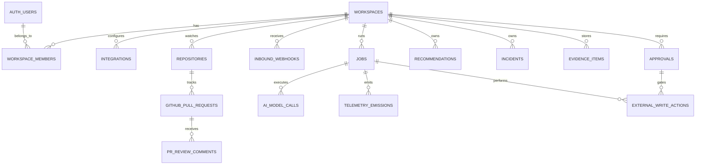

# Instrument ERD

This ERD is the source of truth for the first product slice of Instrument. It is
intentionally smaller than a full production target: the goal is a reliable,
product-shaped foundation that supports the PRD's first validation path without
making the initial implementation carry unnecessary table surface.

Instrument still stores durable workflow state, evidence, approvals, external
write audit, webhook idempotency, and retry telemetry. It does not try to cache
GitHub, Datadog, or TrueFoundry as local systems of record.

## Sources Read

- `docs/PRD.md`
- `design/README.md`
- `design/project/console/data.jsx`
- `design/project/console/views.jsx`
- `design/project/console/incidents.jsx`
- `design/project/console/app.jsx`
- `design/project/console/ui.jsx`
- `design/project/auth.jsx`
- TrueFoundry MCP Gateway docs: https://www.truefoundry.com/docs/ai-gateway/mcp/mcp-overview
- TrueFoundry model metrics API docs: https://www.truefoundry.com/docs/ai-gateway/fetch-model-metrics
- TrueFoundry MCP metrics API docs: https://www.truefoundry.com/docs/ai-gateway/fetch-mcp-metrics
- TrueFoundry request logs API docs: https://www.truefoundry.com/docs/ai-gateway/fetch-request-logs
- TrueFoundry AI Gateway quick start: https://www.truefoundry.com/docs/ai-gateway/quick-start
- TrueFoundry Responses API docs: https://www.truefoundry.com/docs/ai-gateway/responses-api
- TrueFoundry deploy MCP server from code docs: https://www.truefoundry.com/docs/mcp-server-deployment/deploy-mcp-server-from-code
- GitHub MCP server: https://github.com/github/github-mcp-server
- Datadog MCP server: https://docs.datadoghq.com/mcp_server/
- Datadog MCP setup: https://docs.datadoghq.com/bits_ai/mcp_server/setup/
- Datadog MCP tools: https://docs.datadoghq.com/mcp_server/tools/
- Datadog webhooks: https://docs.datadoghq.com/integrations/webhooks/
- GitHub webhook payloads: https://docs.github.com/en/webhooks/webhook-events-and-payloads
- GitHub webhook signature validation: https://docs.github.com/en/webhooks/using-webhooks/validating-webhook-deliveries
- InsForge Functions Architecture: https://docs.insforge.dev/core-concepts/functions/overview
- InsForge Schedules: https://docs.insforge.dev/core-concepts/functions/schedules
- InsForge Compute Architecture: https://docs.insforge.dev/core-concepts/compute/overview
- Reviews from Claude and Gemini of the simplified schema proposal.
- InsForge project instructions in `AGENTS.md`.

## Research-Driven Integration Assumptions

- TrueFoundry MCP Gateway should be the app's governed MCP access layer for
  GitHub MCP, Datadog MCP, and an Instrument-owned TrueFoundry observability MCP
  server. Store gateway/server identifiers, FQNs, tool allowlists, URLs, and
  health in `integrations.config`. Store streamed tool-call summaries in
  `ai_model_calls.tool_calls_redacted`, cited tool results in `evidence_items`,
  and mutating provider calls in `external_write_actions`. Do not store raw
  OAuth tokens or provider keys.
- TrueFoundry AI Gateway should be the only path for LLM calls. Store
  response IDs, model/provider names, schema versions, trace/span IDs, usage,
  latency, validation state, redacted output summaries, and bounded tool-call
  summaries in `ai_model_calls`.
- TrueFoundry model and MCP metrics are fetched from
  `POST /api/svc/v1/llm-gateway/metrics/query` with datasource
  `modelMetrics` or `mcpMetrics`. Persist the query envelope and result snapshot
  as `evidence_items` when the metric output is used as incident or
  recommendation evidence.
- TrueFoundry request logs are fetched through the spans query API
  `POST /api/svc/v1/spans/query`. Persist relevant spans as evidence snapshots,
  keyed by trace/span/request IDs.
- Deploy an Instrument-owned HTTP MCP server on TrueFoundry, preferably with
  Python and FastMCP, to expose bounded read-only tools for TrueFoundry model
  metrics, MCP metrics, request logs, and evidence-bundle lookup. Register that
  server with TrueFoundry MCP Gateway and pass its `integration_fqn` to the
  TrueFoundry Agent API along with GitHub and Datadog MCP servers.
- GitHub MCP supports toolsets such as `repos`, `pull_requests`, `issues`,
  `git`, and tool-level controls. Relevant tools include repository/file reads,
  PR diff/file/review-comment reads, `add_comment_to_pending_review`,
  `pull_request_review_write`, `create_branch`, `create_or_update_file`, and
  `create_pull_request`.
- Datadog MCP provides core tools for logs, metrics, monitors, incidents,
  services, spans, traces, dashboards, events, and notebooks; alerting tools
  include monitor validation, monitor coverage, templates, and
  `create_datadog_monitor`.
- Important Datadog MCP caveat: `create_datadog_monitor` creates a draft monitor
  that does not send notifications. For the first product slice, accepted
  Datadog alert recommendations create draft monitors only; publishing actively
  notifying monitors is later product scope. Store draft monitor results inside
  `recommendations.steps` and write audit rows in `external_write_actions`.
- Datadog remains the source of truth for monitor state, alert state, logs,
  metrics, traces, service ownership, criticality, and notification routing.
- GitHub remains the source of truth for repository, commit, branch, PR, review,
  and comment state.
- InsForge provides Postgres, auth (`auth.users`), RLS, edge functions, storage,
  schedules, frontend deployments, and custom compute. Use migrations for schema
  and RLS. Use server-only secrets/env vars for provider credentials.

## Modeling Principles

- Every user-owned table has `workspace_id` even though the first product slice
  has one workspace. This keeps RLS simple without requiring parent-join
  policies during the first-slice build.
- Store external IDs and cached snapshots, not authoritative copies of external
  systems.
- Store every AI conclusion with evidence references and schema validation
  status before showing it in the console or posting it externally.
- Store every external write in `external_write_actions`. Automatic GitHub PR
  review comments do not require human approval, but they still require audit and
  idempotency.
- Keep the custom TrueFoundry observability MCP server and Agent API MCP tool
  loop as first-class first-slice architecture. They are part of the product
  validation story, not later product scope.
- Use durable `jobs` for all long-running work. Store the first product slice's
  named phases and retry-attempt summaries in bounded `jsonb` arrays on `jobs`.
- Keep normalized tables only where the first product slice needs durable state,
  idempotency, approval, audit, evidence, retry behavior, or simple list/detail
  reads.
- Use compact `jsonb` snapshots for UI-ready child collections, provider
  payload snippets, generated artifact state, progress phases, audit notes, and
  provider-specific configuration.
- GitHub remains authoritative for repositories, commits, PRs, branches, files,
  and review comments.
- Datadog remains authoritative for monitors, alert state, logs, metrics, and
  service metadata.
- TrueFoundry remains authoritative for AI Gateway traces, model metrics, MCP
  gateway registrations, request logs, and deployed MCP service status.
- The first product slice uses one configured workspace and one primary
  repository, but tables still carry `workspace_id` for simple RLS and future
  migration paths.
- MCP call traceability is not a first-class table in this slice. Store tool-call
  summaries on `ai_model_calls.tool_calls_redacted`, store cited tool results as
  `evidence_items`, and store all external writes in `external_write_actions`.

## Implementation Architecture

- Frontend: Vite React TypeScript SPA using Tailwind CSS 3.4, `@insforge/sdk`,
  and Phosphor icons via `@phosphor-icons/react`. The exported design prototype
  includes a self-contained inline SVG icon layer at
  `design/project/assets/icons.js` for portability; production implementation
  should use Phosphor while matching the prototype's icon choices, weight, and
  sizing. Deploy through InsForge frontend deployments.
- Backend/data plane: InsForge Postgres, Auth, RLS, Edge Functions, schedules,
  and server-side secrets. Browser code uses the InsForge anon key with simple
  demo RLS; webhook handlers, job workers, and external write executors use
  server-only InsForge credentials.
- Primary server functions: GitHub webhook ingestion, Datadog webhook ingestion,
  job worker/dispatcher, external action executor, and UI read APIs for
  dashboard/detail views.
- Worker runtime recommendation: implement the first-slice worker as an
  InsForge Edge Function named something like `job-worker-tick`, invoked by an
  InsForge schedule every minute and opportunistically invoked after enqueueing
  important jobs. Each invocation should claim only due jobs, process bounded
  phases under transactional leases, persist progress, and requeue itself through
  `jobs.next_run_at` when additional work remains. InsForge Functions are
  Deno-powered serverless TypeScript intended for request/response and
  short-lived jobs, and schedules invoke functions through cron with a minimum
  one-minute interval. Use InsForge Compute as the fallback when the worker needs
  a process that stays up, longer uninterrupted execution, or background
  concurrency beyond scheduled function ticks. Worker idempotency and persisted
  retry state remain required either way.
- LLM orchestration: TrueFoundry Agent API for tool-using workflows. Attach
  GitHub MCP, Datadog MCP, and Instrument observability MCP servers by
  `integration_fqn` with explicit tool allowlists and bounded iteration limits.
  For the Instrument observability MCP server, pass run context such as
  `job_id`, `ai_model_call_id`, workspace, environment, and trace hints as
  explicit tool arguments whenever the tool needs that context. Do not rely on
  Agent API MCP headers for per-run metadata unless TrueFoundry confirms header
  forwarding semantics. Set `x-tfy-metadata` on Agent API requests for gateway
  routing, metrics, logs, and filtering only; it is not expected to propagate to
  MCP servers. Use TrueFoundry Responses API only for non-tool structured calls.
- Custom MCP service: deploy an Instrument-owned HTTP MCP server on TrueFoundry,
  preferably Python + FastMCP. Register it with TrueFoundry MCP Gateway and
  expose only bounded read-only tools for TrueFoundry model metrics, MCP
  metrics, request logs, trace spans, and existing evidence bundles.
- External systems of record: GitHub remains authoritative for repos, commits,
  PRs, review comments, and generated PRs. Datadog remains authoritative for
  monitors, logs, metrics, traces, incidents, and alert state. TrueFoundry
  remains authoritative for gateway traces, model/MCP metrics, request logs, and
  deployed MCP service status.
- UI updates: start with simple polling against read endpoints, `updated_at`,
  and `jobs.progress_version` while active work is visible. Add InsForge
  realtime only if polling becomes too noisy.

## Conceptual ERD



## Core Tables

1. `workspaces`
2. `workspace_members`
3. `integrations`
4. `repositories`
5. `jobs`
6. `inbound_webhooks`
7. `github_pull_requests`
8. `pr_review_comments`
9. `recommendations`
10. `incidents`
11. `evidence_items`
12. `ai_model_calls`
13. `approvals`
14. `external_write_actions`
15. `telemetry_emissions`

## Enums

Use Postgres enums only for values stored in typed columns. Values used only
inside nested `jsonb` documents should be validated in application code.

- `integration_provider`: `github`, `datadog`, `truefoundry`
- `integration_status`: `connected`, `disconnected`, `degraded`,
  `rate_limited`, `missing_credentials`
- `investigation_start_mode`: `manual`, `auto`, `smart`
- `job_type`: `github_pr_review_analysis`, `proactive_scan`,
  `recommendation_generation`, `datadog_alert_generation`,
  `incident_investigation`, `recommendation_pr_generation`
- `job_state`: `queued`, `running`, `retrying`, `failed`, `succeeded`
- `webhook_auth_method`: `github_signature`, `shared_secret_header`,
  `custom_hmac`, `none`
- `recommendation_category`: `instrumentation`, `alert`, `pr_review`
- `recommendation_state`: `active`, `accepted`, `dismissed`, `outdated`
- `alert_state`: `firing`, `resolved`
- `incident_state`: `active`, `resolved`
- `confidence_level`: `high`, `likely`, `low`
- `evidence_source_type`: `code_file`, `pr_diff`, `commit`,
  `datadog_monitor`, `datadog_metric`, `datadog_log`, `datadog_trace`,
  `datadog_dashboard`, `datadog_alert_event`, `truefoundry_log`,
  `truefoundry_metric`, `mcp_tool_call`, `ai_model_call`, `webhook_payload`
- `evidence_verification_state`: `verified`, `stale`, `unavailable`
- `approval_state`: `requested`, `approved`, `rejected`, `revoked`, `executed`
- `external_action_state`: `planned`, `running`, `succeeded`, `failed`,
  `skipped_duplicate`

## JSON Vocabularies

Validate these in application code, for example with Zod.

- `job_phase_state`: `pending`, `running`, `retrying`, `succeeded`, `failed`,
  `skipped`
- `recommendation_step_kind`: `code_pr`, `datadog_new_monitor`,
  `datadog_monitor_change`, `dashboard_panel`, `manual_check`,
  `pr_review_record`
- `recommendation_step_state`: `locked`, `available`, `generating`, `ready`,
  `done`, `failed`, `skipped`
- `metric_existence_state`: `verified_in_datadog`, `expected_after_step`,
  `unverified`
- `step_completion_source`: `generated_pr_merged`, `datadog_monitor_created`,
  `external_monitor_change`, `manual_mark`, `pr_review_recorded`,
  `dashboard_panel_added`
- `incident_root_cause_type`: `code`, `runtime_config`, `upstream`, `unknown`

## Table Details

### `workspaces`

Single-row in the first product slice. Also stores the settings that were previously modeled
as `workspace_settings`.

| Column | Type | Notes |
| --- | --- | --- |
| `id` | `uuid pk` | |
| `slug` | `text unique not null` | Stable configured workspace slug. |
| `name` | `text not null` | Console display name. |
| `primary_repository_id` | `uuid fk repositories.id null` | Add FK after `repositories` exists. |
| `investigation_start_mode` | `investigation_start_mode not null default 'manual'` | UI labels: Manual, Automatic, Let Instrument decide. |
| `smart_start_rules` | `jsonb not null default '{}'` | Optional deterministic first-slice rules. |
| `primary_branch_scan_cooldown_seconds` | `integer not null default 30` | Short first-slice cooldown. |
| `pr_review_enabled` | `boolean not null default true` | Enables automatic scoped PR comments. |
| `settings_updated_by` | `uuid fk auth.users.id null` | |
| `settings_updated_at` | `timestamptz null` | |
| `created_at`, `updated_at` | `timestamptz not null` | |

### `workspace_members`

References InsForge auth users.

| Column | Type | Notes |
| --- | --- | --- |
| `workspace_id` | `uuid fk workspaces.id` | |
| `user_id` | `uuid fk auth.users.id` | |
| `role` | `text not null default 'owner'` | Initial slice can use `owner`. |
| `created_at` | `timestamptz not null` | |

Primary key: `(workspace_id, user_id)`.

### `integrations`

Represents configured GitHub, Datadog, and TrueFoundry state. TrueFoundry MCP
Gateway FQNs, server URLs, tool allowlists, and health diagnostics live in
`config`; do not create a separate `mcp_servers` table for the first product slice.

| Column | Type | Notes |
| --- | --- | --- |
| `id` | `uuid pk` | |
| `workspace_id` | `uuid fk workspaces.id` | |
| `provider` | `integration_provider not null` | One each for the initial slice. |
| `status` | `integration_status not null` | Drives Integrations view. |
| `display_name` | `text not null` | `GitHub`, `Datadog`, `TrueFoundry`. |
| `external_account_id` | `text null` | Org/account/site identifier. |
| `config` | `jsonb not null default '{}'` | Non-secret config, MCP FQNs/tool allowlists, repo allowlists, Datadog site, gateway labels. |
| `secret_ref` | `text null` | Name/path in InsForge secrets or server env. Never raw secret. |
| `last_checked_at` | `timestamptz null` | |
| `last_error_code` | `text null` | Redacted. |
| `last_error_summary` | `text null` | UI-safe. |
| `created_at`, `updated_at` | `timestamptz not null` | |

Unique: `(workspace_id, provider)`.

### `repositories`

Primary GitHub repository plus first-slice service/path metadata.

| Column | Type | Notes |
| --- | --- | --- |
| `id` | `uuid pk` | |
| `workspace_id` | `uuid fk workspaces.id` | |
| `integration_id` | `uuid fk integrations.id` | GitHub integration. |
| `github_owner` | `text not null` | |
| `github_name` | `text not null` | |
| `external_repo_id` | `text null` | GitHub repository ID. |
| `default_branch` | `text not null default 'main'` | |
| `clone_url` | `text null` | |
| `html_url` | `text null` | |
| `is_primary` | `boolean not null default false` | Primary repo. |
| `pr_review_enabled` | `boolean not null default true` | Scoped automatic comments. |
| `service_map` | `jsonb not null default '[]'` | Path-to-service mappings: path glob, service name, environment, confidence/source. |
| `last_synced_at` | `timestamptz null` | |
| `created_at`, `updated_at` | `timestamptz not null` | |

Unique: `(workspace_id, github_owner, github_name)`.

### `jobs`

Durable state for all long-running workflows. Scans are represented as
`proactive_scan` and/or `recommendation_generation` jobs, not a separate table.

| Column | Type | Notes |
| --- | --- | --- |
| `id` | `uuid pk` | |
| `workspace_id` | `uuid fk workspaces.id` | |
| `job_type` | `job_type not null` | |
| `state` | `job_state not null default 'queued'` | |
| `target_type` | `text not null` | `incident`, `recommendation`, `pull_request`, `repository`, etc. |
| `target_id` | `uuid not null` | Application-enforced polymorphic FK. |
| `target_step_key` | `text null` | Stable key inside `recommendations.steps`. |
| `idempotency_key` | `text not null` | Prevent duplicate jobs. |
| `created_by` | `uuid fk auth.users.id null` | Null for webhook/system jobs. |
| `safe_to_retry` | `boolean not null default true` | Controls Retry button. |
| `attempt_count` | `integer not null default 0` | |
| `max_attempts` | `integer not null default 3` | |
| `retry_policy` | `jsonb not null default '{}'` | Backoff snapshot. |
| `phases` | `jsonb not null default '[]'` | Ordered UI-ready progress objects. |
| `attempts` | `jsonb not null default '[]'` | Bounded attempt summaries. |
| `audit_events` | `jsonb not null default '[]'` | Bounded UI-safe audit notes. |
| `trigger_summary` | `jsonb not null default '{}'` | Push SHA/range, scan freshness, or other trigger metadata. |
| `next_run_at` | `timestamptz null` | Backoff schedule. |
| `locked_by` | `text null` | Worker lease owner. |
| `locked_at` | `timestamptz null` | |
| `lease_expires_at` | `timestamptz null` | Reclaim abandoned jobs. |
| `heartbeat_at` | `timestamptz null` | |
| `failure_integration_id` | `uuid fk integrations.id null` | Shows affected source. |
| `failure_source` | `text null` | `github`, `datadog`, `truefoundry`, `worker`. |
| `error_code` | `text null` | |
| `error_summary` | `text null` | Redacted. |
| `progress_version` | `integer not null default 1` | UI polling hint. |
| `queued_at`, `started_at`, `completed_at` | `timestamptz null` | |
| `created_at`, `updated_at` | `timestamptz not null` | |

Unique: `(workspace_id, job_type, idempotency_key)`.

Recommended indexes:

- `jobs(workspace_id, state, next_run_at, lease_expires_at)`
- `jobs(workspace_id, target_type, target_id, job_type)`
- `jobs(workspace_id, target_type, target_id, target_step_key, job_type)` where
  `target_step_key is not null`

Workers must update JSON progress under a row lock or through atomic JSONB
append/update patterns so progress, attempts, and audit events do not overwrite
each other.

Investigation display mapping:

- no job: `new`
- `queued`, `running`, `retrying`: `investigating`
- `succeeded`: `complete`
- terminal `failed`: failed display state

### `inbound_webhooks`

Stores verified or rejected GitHub and Datadog webhook deliveries. This table is
the source for webhook replay/debug and delivery idempotency.

| Column | Type | Notes |
| --- | --- | --- |
| `id` | `uuid pk` | |
| `workspace_id` | `uuid fk workspaces.id` | |
| `provider` | `integration_provider not null` | `github` or `datadog`. |
| `integration_id` | `uuid fk integrations.id null` | |
| `event_type` | `text not null` | `pull_request`, `push`, `monitor_alert`, etc. |
| `event_action` | `text null` | Provider action/state. |
| `external_delivery_id` | `text not null` | GitHub delivery ID or synthesized Datadog delivery key. |
| `provider_correlation_key` | `text null` | Stable subject key such as Datadog alert cycle key. |
| `auth_method` | `webhook_auth_method not null` | |
| `signature_valid` | `boolean not null default false` | Must be true before downstream work. For shared-secret webhooks this means the configured authentication check passed, not necessarily an HMAC signature. |
| `headers_redacted` | `jsonb not null default '{}'` | |
| `payload_redacted` | `jsonb not null` | Bounded, no secrets. |
| `received_at` | `timestamptz not null` | |
| `processed_at` | `timestamptz null` | |
| `processing_status` | `text not null default 'received'` | `received`, `ignored`, `processed`, `failed`. |
| `error_summary` | `text null` | |

Unique: `(provider, external_delivery_id)`.

For Datadog, synthesize `external_delivery_id` from alert cycle/correlation key,
transition, and event timestamp because Datadog webhooks do not provide a
GitHub-style delivery UUID.

### `github_pull_requests`

Cached PR metadata needed for console records and dedupe.

| Column | Type | Notes |
| --- | --- | --- |
| `id` | `uuid pk` | |
| `workspace_id` | `uuid fk workspaces.id` | |
| `repository_id` | `uuid fk repositories.id` | |
| `external_pr_number` | `integer not null` | |
| `external_node_id` | `text null` | |
| `title` | `text not null` | |
| `author_login` | `text null` | |
| `state` | `text not null` | `open`, `closed`, `merged`, etc. |
| `draft` | `boolean not null default false` | |
| `base_branch` | `text not null` | |
| `head_branch` | `text not null` | |
| `head_sha` | `text not null` | |
| `html_url` | `text null` | |
| `opened_at`, `updated_at`, `closed_at`, `merged_at` | `timestamptz null` | |
| `last_synced_at` | `timestamptz null` | |

Unique: `(repository_id, external_pr_number)`.

Generated recommendation PRs are represented here after GitHub creates or syncs
the PR. Planned/generated state before sync lives in `recommendations.steps` and
`external_write_actions`.

### `pr_review_comments`

Collapsed PR review run/finding/comment table. Tracks automatic review comments
and enough semantic state to dedupe across webhooks and revisions.

| Column | Type | Notes |
| --- | --- | --- |
| `id` | `uuid pk` | |
| `workspace_id` | `uuid fk workspaces.id` | |
| `pull_request_id` | `uuid fk github_pull_requests.id` | |
| `recommendation_id` | `uuid fk recommendations.id null` | Category `pr_review`. |
| `job_id` | `uuid fk jobs.id null` | Analysis job that produced or updated it. |
| `external_write_action_id` | `uuid fk external_write_actions.id null` | Audit link for posted comments. |
| `external_comment_id` | `text null` | GitHub comment/review thread ID. |
| `event_action` | `text null` | PR webhook action that triggered analysis. |
| `head_sha` | `text not null` | Revision analyzed. |
| `semantic_fingerprint` | `text not null` | Stable issue type + file/code anchor + normalized fix summary. Excludes raw line and head SHA. |
| `revision_fingerprint` | `text not null` | Per-revision placement fingerprint. May include head SHA and line. |
| `issue_type` | `text not null` | Example: `missing_latency_metric`. |
| `file_path` | `text not null` | Changed file. |
| `line_number` | `integer not null` | Changed line where suggestion applies. |
| `side` | `text not null default 'RIGHT'` | GitHub diff side. |
| `code_anchor` | `text null` | Function, route, queue, or normalized code context. |
| `body` | `text not null` | Posted/planned review feedback. |
| `suggested_code` | `text null` | Optional snippet. |
| `created_by_model_call_id` | `uuid fk ai_model_calls.id null` | AI provenance. |
| `validated_schema_version` | `text not null` | Required before posting. |
| `status` | `text not null` | `planned`, `posted`, `skipped_duplicate`, `outdated`, `resolved`. |
| `posted_at` | `timestamptz null` | |
| `outdated_at` | `timestamptz null` | |
| `created_at`, `updated_at` | `timestamptz not null` | |

Required constraints:

- Unique per-revision placement:
  `(pull_request_id, revision_fingerprint)`.
- Unique cross-revision posted semantic gap:
  `(pull_request_id, semantic_fingerprint)` where
  `status in ('posted', 'resolved')`.

These two constraints preserve PR-5 and PR-6 after collapsing
`pr_review_runs` and `pr_review_findings`.

### `recommendations`

Proactive, alert, and PR-review recommendations. Scans, generated PRs, generated
Datadog monitors, and lifecycle events are represented through fields and JSON.

| Column | Type | Notes |
| --- | --- | --- |
| `id` | `uuid pk` | |
| `workspace_id` | `uuid fk workspaces.id` | |
| `repository_id` | `uuid fk repositories.id null` | |
| `created_by_job_id` | `uuid fk jobs.id null` | Scan/analysis job that first created it. |
| `last_seen_job_id` | `uuid fk jobs.id null` | Helps dedupe across scans. |
| `category` | `recommendation_category not null` | |
| `state` | `recommendation_state not null default 'active'` | |
| `title` | `text not null` | |
| `rationale` | `text not null` | |
| `service_name` | `text null` | Service string, not FK. |
| `environment` | `text null default 'production'` | |
| `affected_code_path` | `text null` | |
| `affected_runtime_path` | `text null` | Endpoint, queue, dashboard panel, etc. |
| `proposed_next_step` | `text not null` | |
| `steps` | `jsonb not null default '[]'` | Ordered dependent step objects. |
| `steps_schema_version` | `text not null default 'recommendation_steps.v1'` | |
| `lifecycle_events` | `jsonb not null default '[]'` | Bounded state history. |
| `confidence` | `confidence_level null` | Optional for recs. |
| `dedupe_fingerprint` | `text not null` | Stable across scans. |
| `context_hash` | `text null` | Detect staleness. |
| `created_by_model_call_id` | `uuid fk ai_model_calls.id null` | AI provenance. |
| `validated_schema_version` | `text not null` | Required before display. |
| `outdated_reason` | `text null` | Required when state is `outdated`. |
| `superseded_by_recommendation_id` | `uuid fk recommendations.id null` | Replacement, if any. |
| `accepted_at`, `dismissed_at`, `outdated_at` | `timestamptz null` | |
| `created_at`, `updated_at` | `timestamptz not null` | |

Recommended indexes:

- `recommendations(workspace_id, state, category, updated_at desc)`
- `recommendations(workspace_id, dedupe_fingerprint)`

Step objects should include stable keys, order, kind, state, prerequisite key,
target provider, proposed payload, reviewable Datadog diffs, metric verification
state, generated PR branch/URL/file summaries, generated draft monitor ID/URL,
approval ID, job ID, completion source, completion evidence ID, and timestamps.

A recommendation becomes `accepted` only after all required step objects are
`done`.

### `incidents`

Created/updated from authenticated Datadog alert webhooks. Datadog alert event
normalization is folded into this table plus `inbound_webhooks` and
`evidence_items`.

| Column | Type | Notes |
| --- | --- | --- |
| `id` | `uuid pk` | |
| `workspace_id` | `uuid fk workspaces.id` | |
| `webhook_event_id` | `uuid fk inbound_webhooks.id null` | Creation/update source. |
| `caused_by_job_id` | `uuid fk jobs.id null` | Reliability-validation link from telemetry incident to original job. |
| `external_alert_key` | `text not null` | Datadog alert/monitor key. |
| `incident_correlation_key` | `text not null` | Used to update current open incident. |
| `alert_transition_key` | `text null` | Per-transition dedupe key from Datadog payload. |
| `external_monitor_id` | `text null` | Datadog monitor ID when available. |
| `datadog_event_id` | `text null` | Datadog event ID when available. |
| `datadog_url` | `text null` | Event/monitor URL when available. |
| `service_name` | `text null` | |
| `environment` | `text null default 'production'` | |
| `title` | `text not null` | |
| `description` | `text null` | |
| `source` | `text not null default 'Datadog monitor'` | |
| `alert_state` | `alert_state not null` | |
| `incident_state` | `incident_state not null default 'active'` | |
| `investigation_job_id` | `uuid fk jobs.id null` | Current/last investigation. |
| `investigation_start_mode_snapshot` | `investigation_start_mode not null` | Captured at creation. |
| `started_automatically` | `boolean not null default false` | UI badge. |
| `signals` | `jsonb not null default '[]'` | Key signal objects with evidence IDs when available. |
| `timeline` | `jsonb not null default '[]'` | Ordered UI timeline. |
| `hypotheses` | `jsonb not null default '[]'` | Ranked validated RCA output. |
| `correlated_changes` | `jsonb not null default '[]'` | Commit/PR/change pointers. |
| `alert_payload_summary` | `jsonb not null default '{}'` | Bounded Datadog alert snapshot. |
| `started_at` | `timestamptz not null` | Alert start. |
| `resolved_at` | `timestamptz null` | |
| `created_at`, `updated_at` | `timestamptz not null` | |

Required partial unique index:

- `(workspace_id, incident_correlation_key)` where
  `incident_state = 'active'`.

Recommended indexes:

- `incidents(workspace_id, incident_state, started_at desc)`
- `incidents(workspace_id, alert_state, updated_at desc)`

### `evidence_items`

All evidence cited by recommendations, PR comments, jobs, and incident
hypotheses. Datadog monitor snapshots, alert event snapshots, TrueFoundry metric
queries, request logs, spans, and GitHub file/diff evidence live here.

| Column | Type | Notes |
| --- | --- | --- |
| `id` | `uuid pk` | |
| `workspace_id` | `uuid fk workspaces.id` | |
| `source_type` | `evidence_source_type not null` | |
| `source_provider` | `integration_provider null` | |
| `collected_by_job_id` | `uuid fk jobs.id null` | |
| `ai_model_call_id` | `uuid fk ai_model_calls.id null` | Set when cited or produced by a model call. |
| `subject_type` | `text not null` | `recommendation`, `incident`, `pr_review_comment`, `job`, etc. |
| `subject_id` | `uuid not null` | App-enforced polymorphic subject. |
| `subject_key` | `text null` | Nested key, such as recommendation step key or hypothesis rank. |
| `claim_type` | `text not null default 'fact'` | `fact`, `inference_support`, `suggested_action_support`, `counter_evidence`. |
| `external_id` | `text null` | Commit SHA, monitor ID, trace ID, response ID, etc. |
| `uri` | `text null` | GitHub/Datadog/TrueFoundry URL if available. |
| `title` | `text not null` | Human-readable citation title. |
| `summary` | `text not null` | UI-safe summary. |
| `payload` | `jsonb not null default '{}'` | Redacted, bounded snapshot. |
| `content_hash` | `text not null` | Detect stale evidence. |
| `verification_state` | `evidence_verification_state not null default 'verified'` | |
| `observed_at` | `timestamptz null` | Time evidence was true in source system. |
| `collected_at` | `timestamptz not null` | |

Indexes:

- `evidence_items(workspace_id, source_type, external_id)`
- `evidence_items(workspace_id, subject_type, subject_id)`

### `ai_model_calls`

LLM calls through TrueFoundry AI Gateway or Agent API only.

| Column | Type | Notes |
| --- | --- | --- |
| `id` | `uuid pk` | |
| `workspace_id` | `uuid fk workspaces.id` | |
| `integration_id` | `uuid fk integrations.id` | TrueFoundry integration. |
| `job_id` | `uuid fk jobs.id` | |
| `purpose` | `text not null` | `recommendation_schema`, `incident_hypotheses`, etc. |
| `api_surface` | `text not null` | `agent_chat_completions` or `responses`. |
| `truefoundry_response_id` | `text null` | |
| `truefoundry_trace_id` | `text null` | |
| `truefoundry_span_id` | `text null` | |
| `gateway_base_url_name` | `text null` | Non-secret label. |
| `provider_name` | `text null` | |
| `model_name` | `text not null` | |
| `agent_iteration_limit` | `integer null` | |
| `mcp_servers_requested` | `jsonb null` | Redacted Agent API server entries: FQNs, enabled tools, no secrets. |
| `tool_calls_redacted` | `jsonb not null default '[]'` | Bounded MCP/tool summaries. Cited results still become `evidence_items`. |
| `request_schema_version` | `text not null` | |
| `output_schema_version` | `text not null` | |
| `input_hash` | `text not null` | Avoid storing large prompts. |
| `output_redacted` | `jsonb null` | Validated structured output, redacted. |
| `validation_status` | `text not null` | `valid`, `invalid`, `not_applicable`. |
| `input_tokens`, `output_tokens`, `total_tokens` | `integer null` | |
| `cost_usd` | `numeric null` | |
| `latency_ms` | `integer null` | |
| `status` | `text not null` | `succeeded`, `failed`, `rate_limited`. |
| `error_code`, `error_summary` | `text null` | Redacted. |
| `started_at`, `completed_at` | `timestamptz` | |

Indexes:

- `ai_model_calls(workspace_id, truefoundry_response_id)`
- `ai_model_calls(workspace_id, truefoundry_trace_id)`

### `approvals`

Human approval gate for recommendation PR generation, Datadog draft monitor
creation, and other external writes. Keep separate from
`external_write_actions` so approved payload drift can be detected.

| Column | Type | Notes |
| --- | --- | --- |
| `id` | `uuid pk` | |
| `workspace_id` | `uuid fk workspaces.id` | |
| `action_type` | `text not null` | `generate_recommendation_pr`, `create_datadog_monitor`, `mark_external_monitor_change`. |
| `target_type` | `text not null` | Usually `recommendation`. |
| `target_id` | `uuid not null` | |
| `target_step_key` | `text null` | Stable key inside `recommendations.steps`. |
| `requested_by` | `uuid fk auth.users.id null` | |
| `approved_by` | `uuid fk auth.users.id null` | |
| `state` | `approval_state not null default 'requested'` | |
| `approval_summary` | `text not null` | What human approved. |
| `approved_payload_hash` | `text null` | Hash of exact redacted request/config approved. |
| `approval_version` | `integer not null default 1` | Increment if proposed payload changes. |
| `created_at`, `approved_at`, `executed_at` | `timestamptz null` | |

### `external_write_actions`

Every write to GitHub, Datadog, or TrueFoundry-managed MCP tools. This is the
single idempotency anchor for provider writes.

| Column | Type | Notes |
| --- | --- | --- |
| `id` | `uuid pk` | |
| `workspace_id` | `uuid fk workspaces.id` | |
| `approval_id` | `uuid fk approvals.id null` | Null only for automatic GitHub PR review comments. |
| `job_id` | `uuid fk jobs.id null` | |
| `provider` | `integration_provider not null` | |
| `action_kind` | `text not null` | `github_review_comment`, `github_create_branch`, `github_update_file`, `github_create_pr`, `datadog_create_monitor`. |
| `idempotency_key` | `text not null` | Required. Use branch name or PR/comment semantic keys where appropriate. |
| `target_summary` | `text not null` | UI-safe target. |
| `request_hash` | `text not null` | Must match approval payload hash for approval-gated writes. |
| `request_redacted` | `jsonb not null default '{}'` | |
| `response_summary` | `jsonb not null default '{}'` | |
| `external_id` | `text null` | PR number, comment ID, monitor ID. |
| `external_url` | `text null` | |
| `state` | `external_action_state not null default 'planned'` | |
| `started_at`, `completed_at` | `timestamptz null` | |
| `error_code`, `error_summary` | `text null` | |

Unique: `(workspace_id, provider, action_kind, idempotency_key)`.

The external action executor must reject every row except
`github_review_comment` unless it references an approved, unrevoked approval and
`request_hash` equals `approvals.approved_payload_hash`.

### `telemetry_emissions`

Metrics/events Instrument emits about its own reliability, especially retry and
error telemetry used by the TrueFoundry/Datadog reliability proof.

| Column | Type | Notes |
| --- | --- | --- |
| `id` | `uuid pk` | |
| `workspace_id` | `uuid fk workspaces.id` | |
| `job_id` | `uuid fk jobs.id null` | |
| `attempt_number` | `integer null` | Mirrors `jobs.attempts` when available. |
| `integration_id` | `uuid fk integrations.id null` | Source involved in failure/retry. |
| `incident_id` | `uuid fk incidents.id null` | Incident created from this telemetry, when known. |
| `metric_name` | `text not null` | Example: `instrument.job.retry`. |
| `tags` | `jsonb not null default '{}'` | Include service/environment/workflow/integration/error tags for Datadog routing. |
| `value` | `numeric not null default 1` | |
| `truefoundry_trace_id` | `text null` | |
| `truefoundry_request_id` | `text null` | |
| `external_monitor_id` | `text null` | Datadog monitor that fired, when known. |
| `emission_state` | `external_action_state not null default 'planned'` | |
| `idempotency_key` | `text not null` | Prevent duplicate emission submission. |
| `emitted_at` | `timestamptz null` | |
| `created_at` | `timestamptz not null` | |

Unique: `(workspace_id, metric_name, idempotency_key)`.

Avoid raw job IDs as Datadog metric tags. Correlate job IDs app-side using trace
IDs, request IDs, emitted timestamps, and `telemetry_emissions.job_id`.

## Folded Tables and Where Their Data Lives

| Old table | First-slice location |
| --- | --- |
| `workspace_settings` | Settings columns on `workspaces`. |
| `mcp_servers` | TrueFoundry MCP config in `integrations.config`. |
| `mcp_tool_invocations` | `ai_model_calls.tool_calls_redacted`; cited outputs in `evidence_items`; writes in `external_write_actions`. |
| `services` | `service_name` and `environment` fields plus `repositories.service_map`. |
| `repository_service_paths` | `repositories.service_map`. |
| `github_push_events` | `inbound_webhooks.payload_redacted` plus `jobs.trigger_summary`. |
| `github_pr_files` | GitHub reads on demand; commented files in `pr_review_comments`; evidence in `evidence_items`. |
| `pr_review_runs` | `jobs` and `pr_review_comments`. |
| `pr_review_findings` | `pr_review_comments.semantic_fingerprint`. |
| `job_audit_events` | `jobs.audit_events`. |
| `scans` | `jobs` with `job_type = 'proactive_scan'` and `recommendations.created_by_job_id` / `last_seen_job_id`. |
| `recommendation_events` | `recommendations.lifecycle_events`. |
| `generated_pull_requests` | `recommendations.steps` plus `github_pull_requests` after sync and `external_write_actions` for writes. |
| `generated_datadog_monitors` | `recommendations.steps` plus `external_write_actions` and `evidence_items`. |
| `datadog_monitors` | Snapshots in `evidence_items` and recommendation/incident JSON. |
| `datadog_alert_events` | `inbound_webhooks`, `incidents.alert_payload_summary`, and `evidence_items`. |
| `app_events` | Poll `updated_at`, `jobs.progress_version`, and current list/detail endpoints. |

## Traceability to PRD Requirements

- PR observability review: `inbound_webhooks`, `github_pull_requests`,
  `pr_review_comments`, `recommendations`, `evidence_items`,
  `ai_model_calls`, and `external_write_actions`.
- Recommendation lifecycle and archive: `recommendations`,
  `recommendations.steps`, and `recommendations.lifecycle_events`.
- Multi-step dependent recommendations: `recommendations.steps[].order` and
  `recommendations.steps[].prerequisite_step_key`.
- Generated recommendation PRs: `recommendations.steps`,
  `external_write_actions`, `jobs`, `approvals`, and `github_pull_requests`
  after GitHub sync.
- Datadog alert recommendations: `recommendations.steps[].configuration_diff`,
  `recommendations.steps[].verification_state`, `evidence_items`,
  `approvals`, and `external_write_actions`.
- Datadog incident ingestion and investigation: `inbound_webhooks`,
  `incidents`, `incidents.signals`, `incidents.timeline`,
  `incidents.hypotheses`, `incidents.correlated_changes`, `jobs`, and
  `evidence_items`.
- Durable progress/retry/failure states: `jobs.phases`, `jobs.attempts`,
  `jobs.audit_events`, and `jobs.progress_version`.
- Evidence and confidence: `evidence_items`, `ai_model_calls`, and
  `incidents.hypotheses`.
- Integration health: `integrations`.
- TrueFoundry reliability proof: `jobs` in `retrying`, `jobs.attempts`,
  `telemetry_emissions`, `ai_model_calls`, `ai_model_calls.tool_calls_redacted`,
  `incidents.signals`, and `evidence_items`.
- Live console updates and debouncing: `updated_at`, `jobs.progress_version`,
  and current list/detail read endpoints.

## RLS and Security Notes

- Enable RLS on all workspace-owned tables.
- Use a simple helper such as
  `private.is_workspace_member(target_workspace_id uuid)` with
  `security definer` to avoid recursive policies.
- First-slice demo boundary: signed-in workspace members get `select` access to
  rows in their workspace. Normal browser sessions should not directly insert
  provider data, create jobs, create approvals, mutate external write audit rows,
  or update incident/recommendation/generated-artifact state.
- User-initiated mutations should go through small Edge Function endpoints using
  server-only credentials: change investigation-start setting, request/reject an
  approval, dismiss/restore a recommendation, start/retry an investigation, and
  enqueue approved generation jobs. Those functions must validate membership,
  target workspace, allowed transition, idempotency key, and payload hash before
  writing.
- For the demo, a narrow direct `update` policy on `workspaces` is acceptable
  only for `investigation_start_mode`, `smart_start_rules`,
  `settings_updated_by`, `settings_updated_at`, and `updated_at`; all other
  `workspaces` edits stay service-only.
- For `workspaces`, check membership against `workspaces.id`.
- For `workspace_members`, allow a signed-in user to read only their own
  membership rows with a direct `user_id = auth.uid()` policy; do not call
  `private.is_workspace_member` from the `workspace_members` policy, because that
  can recurse. Service-role code handles seed/admin writes.
- Background workers, webhook handlers, and scheduled jobs should run with
  server-only credentials and must still write `workspace_id`.
- Never store provider tokens, API keys, webhook secrets, TrueFoundry PAT/VAT
  values, or InsForge admin keys in relational columns. Store only
  `secret_ref`, status, and redacted diagnostics.
- `inbound_webhooks.signature_valid` must be true before downstream job,
  incident, recommendation, or external write creation.
- `external_write_actions.approval_id` must be non-null for mutating actions
  except `github_review_comment`. For the first product slice, enforce approval
  state and request-hash equality in the external action executor; add a
  database trigger later only if this flow needs stronger defense-in-depth.
- Automatic PR comments must be scoped by `workspaces.pr_review_enabled`,
  `repositories.pr_review_enabled`, and repository allowlist config.
- Webhook processing should only create incidents/jobs after signature or shared
  secret verification and under a transactional lock keyed by delivery ID or
  alert transition key.

## Manual Provisioning Required

The ERD assumes these are supplied outside the database:

- InsForge project is linked and configured for `instrument`.
- InsForge auth has one configured user and one workspace membership.
- InsForge server-side env/secrets include any required app/admin keys. Do not
  expose admin keys to the frontend.
- TrueFoundry account/tenant, control plane URL, gateway base URL, and an
  application-appropriate API key, preferably a VAT for deployed app code.
- TrueFoundry model provider account(s), model name(s), and
  `x-tfy-provider-name` value for AI Gateway calls.
- TrueFoundry deployment for the Instrument observability MCP server, preferably
  an HTTP Python/FastMCP service, with server-side secrets for TrueFoundry metric
  and request-log APIs. It returns tool results only; it does not need an
  InsForge service credential. This should be available before incident
  investigation is implemented, not deferred to the final reliability demo.
- TrueFoundry MCP Gateway registration for GitHub MCP, Datadog MCP, and the
  Instrument observability MCP server, with copied MCP server FQNs, copied MCP
  server URLs, allowed toolsets, and write-tool governance/approval policies.
  Store these non-secret values in `integrations.config`. GitHub and Datadog MCP
  registration should be completed before PR review and monitor analysis work
  begins; the Instrument observability MCP server can start as a minimal bounded
  read-only service and be hardened during investigation/reliability tasks.
- GitHub repository allowlist, webhook secret, and token/OAuth credentials
  capable of reading repos/PRs/diffs and posting scoped PR review comments.
  If recommendation PR generation is enabled, credentials also need branch/file
  write and PR create permissions.
- Datadog site, webhook shared-secret/custom-header configuration, and Datadog
  MCP auth. Datadog MCP needs `mcp_read` for reads and `mcp_write` plus
  resource-level permissions for draft monitor creation. Publishing notifying
  monitors is not in first-slice scope.
- The Datadog webhook template must include fields sufficient to synthesize
  `external_delivery_id`, `alert_transition_key`, and
  `incident_correlation_key`.
- Reliability-validation Datadog monitor(s) that trigger on
  Instrument/TrueFoundry retry/error telemetry, unless monitor publishing is
  implemented after human approval.
- Telemetry tags/attributes for the reliability proof, including service,
  environment, stable workflow name, integration source, error/rate-limit code,
  and trace/request IDs. Avoid raw job IDs as Datadog metric tags; use
  application-side correlation to set `incidents.caused_by_job_id`.

## Webhook Payload Alignment

### GitHub

- Delivery headers map to `inbound_webhooks`: `X-GitHub-Delivery` to
  `external_delivery_id`, `X-GitHub-Event` to `event_type`, and redacted
  signature/hook headers to `headers_redacted`.
- Signature verification uses `X-Hub-Signature-256` and sets
  `auth_method = 'github_signature'` plus `signature_valid = true` before any
  downstream row is created.
- `pull_request` payloads map to `github_pull_requests` using payload `number`,
  `pull_request` fields such as title/state/draft/base/head/URLs/timestamps,
  and payload `repository` and `sender` metadata.
- `pull_request` events for `opened`, `reopened`, `synchronize`, and
  `ready_for_review` enqueue `github_pr_review_analysis` jobs and write or
  update `pr_review_comments`; `closed`/merged payloads update generated PR and
  recommendation lifecycle state.
- `push` payloads are stored in `inbound_webhooks.payload_redacted` using
  `ref`, `before`, `after`, `base_ref`, `compare`, `created`, `deleted`,
  `forced`, `pusher`, `head_commit`, and the bounded `commits` array. Primary
  branch push events then create or coalesce `proactive_scan` jobs, with
  scan-trigger metadata in `jobs.trigger_summary`.

### Datadog

Datadog webhooks are template-driven rather than a fixed alert JSON envelope.
The configured Datadog webhook payload should emit this minimum JSON contract:

```json
{
  "alert_id": "$ALERT_ID",
  "alert_cycle_key": "$ALERT_CYCLE_KEY",
  "alert_transition": "$ALERT_TRANSITION",
  "event_id": "$ID",
  "event_url": "$LINK",
  "event_title": "$EVENT_TITLE",
  "event_msg": "$TEXT_ONLY_MSG",
  "event_type": "$EVENT_TYPE",
  "date": "$DATE",
  "last_updated": "$LAST_UPDATED",
  "tags": "$TAGS",
  "service": "$TAGS[service]",
  "env": "$TAGS[env]",
  "instrument_reliability": "$TAGS[instrument_reliability]"
}
```

Mapping rules:

- `inbound_webhooks.external_delivery_id` is synthesized from
  `alert_cycle_key`, `alert_transition`, and `date` or `last_updated`.
- `inbound_webhooks.provider_correlation_key` and
  `incidents.incident_correlation_key` use `alert_cycle_key` when present;
  otherwise fall back to monitor ID plus scope tags.
- `incidents.external_monitor_id` uses `alert_id`.
- `incidents.alert_transition_key` uses the synthesized transition key.
- `Recovered` maps to `alert_state = 'resolved'`; other first-slice alert transitions
  map to `alert_state = 'firing'`.
- Datadog authentication should use a shared secret/custom header or supported
  Datadog auth method. Only process rows with `signature_valid = true`.

## Implementation Notes for AI Agents

- Implement migrations with the 15 core tables and required enums.
- Implement webhook ingestion idempotently before PR review or incident workers.
- Subscribe GitHub to `pull_request` and `push` webhooks. Use
  `X-GitHub-Delivery` for `external_delivery_id`, `X-GitHub-Event` for
  `event_type`, and validate `X-Hub-Signature-256` before processing. PR review
  analysis should handle at least `opened`, `reopened`, `synchronize`, and
  `ready_for_review`; PR merge/close transitions should update recommendation
  and generated PR lifecycle.
- For `push` events to the repository's primary branch, record every delivery
  and enqueue a proactive scan for the latest commit SHA. Use a short cooldown
  plus coalescing: if a scan is running or a scan was queued/completed very
  recently, mark pending scan metadata and run one follow-up scan for the newest
  `after` SHA when the active scan finishes.
- Configure Datadog webhook payload JSON explicitly with the variables listed in
  the Datadog section above; Datadog does not send a fixed alert JSON envelope.
- Implement job workers with transactional leases or `for update skip locked`;
  a browser refresh should only read `jobs.phases`, `jobs.attempts`, and related
  aggregate rows, never restart work.
- Implement the worker as a scheduled Edge Function tick by default. Keep each
  invocation short, claim due jobs under a lease, process bounded work, and
  requeue through `jobs.next_run_at` when additional work remains. Use Compute
  only if the scheduled function model proves insufficient and the project has
  Compute enabled.
- Use `jobs` for durable workflow state, scan state, progress phases, retry
  attempts, failure state, and bounded audit notes.
- Use simple polling against list/detail endpoints, `updated_at`, and
  `jobs.progress_version`. Do not create `app_events` for the initial slice.
- For PR review, compute `semantic_fingerprint` from repository/PR, issue type,
  file path, stable code anchor, and normalized proposed fix summary. Do not
  include raw line number or `head_sha`.
- Use `revision_fingerprint` for same-revision placement dedupe.
- For recommendation dedupe, compute `dedupe_fingerprint` from category,
  service, code/runtime path, metric/monitor name if any, and normalized action.
- Validate AI output before writing `recommendations`, `recommendations.steps`,
  `pr_review_comments`, or `incidents.hypotheses`, and require evidence items
  before display/post.
- Store enough redacted provider payload to explain what happened, but prefer
  compact evidence, hashes, and external URLs over large raw blobs.
- Treat Datadog ownership, criticality, and notification routing as optional
  facts. Null or absence is correct when Datadog does not provide metadata.
- Incident fix PR generation remains later product scope.
- Existing Datadog monitor edits are reviewable/manual recommendations for the
  initial slice. Creating new draft monitors after approval is in scope.
- The reliability-validation Datadog monitor should be manually preconfigured or
  otherwise provisioned outside Instrument's draft-monitor flow, because
  publishing notifying monitors is not first-slice scope.
- For generated PR audit, patch hashes/excerpts plus GitHub links are
  sufficient; GitHub remains the source of truth for full diffs and commits.
- For the reliability proof, smart investigation start can initially rely on the
  alert copy and configured monitor semantics rather than a deterministic
  keyword/tag rule. If stricter behavior is needed, add a simple Datadog tag or
  keyword rule into `workspaces.smart_start_rules`.
- TrueFoundry model metrics, MCP metrics, and request logs are exposed to the
  Agent API through the Instrument observability MCP server. The MCP tools call
  TrueFoundry HTTP APIs internally, enforce approved query templates and bounded
  time windows, and return compact structured results. The Agent API caller/job
  worker parses streamed tool call/result events, stores bounded summaries in
  `ai_model_calls.tool_calls_redacted`, and persists cited metric/log/span
  snapshots as `evidence_items` after the call. Server-side jobs may still
  prefetch evidence for deterministic workflows, but tool-using investigations
  should prefer the custom MCP server.
- When parsing Agent API streams, store documented IDs when present but do not
  require `tool_call_id` or similar fields. The persistence fallback is the
  enclosing `job_id`, `ai_model_call_id`, MCP server FQN/tool name, stream event
  order, TrueFoundry trace/request IDs, and redacted tool arguments/result
  hashes.
