# Instrument ERD

This ERD is for AI-assisted implementation of the hackathon demo described in
`docs/PRD.md`. It models Instrument as a Postgres-backed app on InsForge that
persists durable workflow state, evidence, audit history, generated actions, and
integration health while leaving GitHub, Datadog, and TrueFoundry as external
systems of record.

## Sources Read

- `docs/PRD.md`
- `design/README.md`
- `design/project/console/app.jsx`
- `design/project/console/views.jsx`
- `design/project/console/incidents.jsx`
- `design/project/console/ui.jsx`
- `design/project/console/data.jsx`
- `design/project/auth.jsx`
- TrueFoundry MCP Gateway docs: https://www.truefoundry.com/docs/ai-gateway/mcp/mcp-overview
- TrueFoundry model metrics API docs: https://www.truefoundry.com/docs/ai-gateway/fetch-model-metrics
- TrueFoundry MCP metrics API docs: https://www.truefoundry.com/docs/ai-gateway/fetch-mcp-metrics
- TrueFoundry request logs API docs: https://www.truefoundry.com/docs/ai-gateway/fetch-request-logs
- TrueFoundry AI Gateway quick start: https://www.truefoundry.com/docs/ai-gateway/quick-start
- TrueFoundry Responses API docs: https://www.truefoundry.com/docs/ai-gateway/responses-api
- GitHub MCP server: https://github.com/github/github-mcp-server
- Datadog MCP server: https://docs.datadoghq.com/mcp_server/
- Datadog MCP setup: https://docs.datadoghq.com/bits_ai/mcp_server/setup/
- Datadog MCP tools: https://docs.datadoghq.com/mcp_server/tools/
- InsForge CLI skill and local `AGENTS.md` instructions

## Research-Driven Integration Assumptions

- TrueFoundry MCP Gateway should be the app's governed MCP access layer for
  GitHub MCP and Datadog MCP. Store only gateway/server identifiers, tool
  invocations, redacted inputs, redacted summaries, and evidence references.
  Do not store raw OAuth tokens or provider keys.
- TrueFoundry AI Gateway should be the only path for LLM calls. Store
  `response_id`, model/provider names, schema version, trace/span IDs, usage,
  latency, validation state, and redacted output summaries.
- TrueFoundry model and MCP metrics are fetched from
  `POST /api/svc/v1/llm-gateway/metrics/query` with datasource
  `modelMetrics` or `mcpMetrics`. Persist the query envelope and result snapshot
  when the metric output is used as incident or recommendation evidence.
- TrueFoundry request logs are fetched through the spans query API
  `POST /api/svc/v1/spans/query`. Persist relevant spans as evidence, keyed by
  trace/span/request IDs.
- GitHub MCP supports toolsets such as `repos`, `pull_requests`, `issues`,
  `git`, and tool-level controls. Relevant tools include repository/file reads,
  PR diff/file/review-comment reads, `add_comment_to_pending_review`,
  `pull_request_review_write`, `create_branch`, `create_or_update_file`, and
  `create_pull_request`.
- Datadog MCP provides core tools for logs, metrics, monitors, incidents,
  services, spans, traces, dashboards, events, and notebooks; alerting tools
  include monitor validation, monitor coverage, templates, and
  `create_datadog_monitor`.
- Important Datadog MCP caveat: `create_datadog_monitor` creates a draft monitor
  that does not send notifications. The ERD supports draft and published states.
  If the demo requires an actively notifying monitor created from Instrument, the
  implementation must either publish through an approved Datadog API path after
  explicit human approval or pre-provision/publish the demo monitor manually.
- Datadog remains the source of truth for monitor state, alert state, logs,
  metrics, traces, service ownership, criticality, and notification routing.
- GitHub remains the source of truth for repository, commit, branch, PR, review,
  and comment state.
- InsForge provides Postgres, auth (`auth.users`), RLS, edge functions, storage,
  schedules, and frontend deployments. Use migrations for schema and RLS. Use
  server-only secrets/env vars for provider credentials.

## Modeling Principles

- Every user-owned table has `workspace_id` even though the demo has one
  workspace. This keeps RLS simple and lets the implementation grow later.
- Store external IDs and cached snapshots, not authoritative copies of external
  systems.
- Store every AI conclusion with evidence references and schema validation
  status before showing it in the console or posting it externally.
- Store every external write in `external_write_actions`. Automatic GitHub PR
  review comments do not require human approval, but they still require audit and
  idempotency.
- Use durable `jobs`, `job_phases`, and `job_attempts` for all long-running work.
  The UI derives progress and failure states from these rows.
- Use `jsonb` for provider-specific payloads, redacted request/response
  summaries, and configuration diffs where external schemas are too unstable for
  first-pass normalized columns.

## Conceptual ERD

```mermaid
erDiagram
  AUTH_USERS ||--o{ WORKSPACE_MEMBERS : belongs_to
  WORKSPACES ||--o{ WORKSPACE_MEMBERS : has
  WORKSPACES ||--|| WORKSPACE_SETTINGS : configures
  WORKSPACES ||--o{ INTEGRATIONS : has
  INTEGRATIONS ||--o{ INTEGRATION_STATUS_EVENTS : records
  INTEGRATIONS ||--o{ MCP_SERVERS : exposes
  MCP_SERVERS ||--o{ MCP_TOOL_INVOCATIONS : executes

  WORKSPACES ||--o{ SERVICES : owns
  WORKSPACES ||--o{ REPOSITORIES : owns
  REPOSITORIES ||--o{ REPOSITORY_SERVICE_PATHS : maps
  SERVICES ||--o{ REPOSITORY_SERVICE_PATHS : maps

  REPOSITORIES ||--o{ GITHUB_PULL_REQUESTS : has
  REPOSITORIES ||--o{ GITHUB_COMMITS : has
  GITHUB_PULL_REQUESTS ||--o{ GITHUB_PR_COMMITS : includes
  GITHUB_COMMITS ||--o{ GITHUB_PR_COMMITS : included_in
  GITHUB_PULL_REQUESTS ||--o{ GITHUB_PR_FILES : changes
  GITHUB_PULL_REQUESTS ||--o{ PR_REVIEW_RUNS : analyzed_by
  PR_REVIEW_RUNS ||--o{ PR_REVIEW_COMMENTS : posts

  WORKSPACES ||--o{ INBOUND_WEBHOOKS : receives
  WORKSPACES ||--o{ JOBS : runs
  JOBS ||--o{ JOB_PHASES : has
  JOBS ||--o{ JOB_ATTEMPTS : retries
  JOBS ||--o{ JOB_AUDIT_EVENTS : audits
  JOBS ||--o{ MCP_TOOL_INVOCATIONS : calls
  JOBS ||--o{ AI_MODEL_CALLS : prompts
  JOBS ||--o{ EXTERNAL_WRITE_ACTIONS : performs

  REPOSITORIES ||--o{ SCANS : scanned_by
  JOBS ||--o{ SCANS : backs
  SCANS ||--o{ RECOMMENDATIONS : produces
  RECOMMENDATIONS ||--o{ RECOMMENDATION_STEPS : has
  RECOMMENDATIONS ||--o{ RECOMMENDATION_EVENTS : changes
  RECOMMENDATION_STEPS ||--o{ GENERATED_PULL_REQUESTS : may_open
  RECOMMENDATION_STEPS ||--o{ GENERATED_DATADOG_MONITORS : may_create

  SERVICES ||--o{ OBSERVED_METRICS : emits_or_requires
  INTEGRATIONS ||--o{ DATADOG_MONITORS : caches
  DATADOG_MONITORS ||--o{ INCIDENTS : triggers
  DATADOG_MONITORS ||--o{ GENERATED_DATADOG_MONITORS : source_or_result

  SERVICES ||--o{ INCIDENTS : affected_by
  INBOUND_WEBHOOKS ||--o{ INCIDENTS : creates_or_updates
  INCIDENTS ||--o{ INCIDENT_SIGNALS : shows
  INCIDENTS ||--o{ INCIDENT_TIMELINE_EVENTS : records
  INCIDENTS ||--o{ INCIDENT_HYPOTHESES : explains

  WORKSPACES ||--o{ EVIDENCE_ITEMS : stores
  EVIDENCE_ITEMS ||--o{ EVIDENCE_LINKS : supports
  JOBS ||--o{ EVIDENCE_ITEMS : collects
  AI_MODEL_CALLS ||--o{ EVIDENCE_ITEMS : cites
  TRUEFOUNDRY_METRIC_QUERIES ||--o{ EVIDENCE_ITEMS : produces
  TRUEFOUNDRY_SPANS ||--o{ EVIDENCE_ITEMS : produces

  WORKSPACES ||--o{ APPROVALS : requires
  APPROVALS ||--o{ EXTERNAL_WRITE_ACTIONS : authorizes
```

## Proposed Postgres Enums

- `integration_provider`: `github`, `datadog`, `truefoundry`
- `integration_status`: `connected`, `disconnected`, `degraded`,
  `rate_limited`, `missing_credentials`
- `investigation_start_mode`: `manual`, `auto`, `smart`
- `job_type`: `github_pr_review_analysis`, `proactive_scan`,
  `recommendation_generation`, `datadog_monitor_analysis`,
  `datadog_alert_generation`, `incident_investigation`,
  `recommendation_pr_generation`, `truefoundry_metrics_ingest`,
  `truefoundry_logs_ingest`
- `job_state`: `queued`, `running`, `retrying`, `failed`, `succeeded`,
  `cancelled`
- `job_phase_state`: `pending`, `running`, `retrying`, `succeeded`, `failed`,
  `skipped`
- `recommendation_category`: `instrumentation`, `alert`, `pr_review`
- `recommendation_state`: `active`, `accepted`, `dismissed`, `outdated`
- `recommendation_step_kind`: `code_pr`, `datadog_new_monitor`,
  `datadog_monitor_change`, `dashboard_panel`, `manual_check`,
  `pr_review_record`
- `recommendation_step_state`: `locked`, `available`, `generating`, `ready`,
  `done`, `failed`, `skipped`
- `alert_state`: `firing`, `resolved`
- `incident_state`: `active`, `resolved`
- `confidence_level`: `high`, `likely`, `low`
- `evidence_source_type`: `code_file`, `pr_diff`, `commit`,
  `datadog_monitor`, `datadog_metric`, `datadog_log`, `datadog_trace`,
  `datadog_dashboard`, `datadog_alert_event`, `truefoundry_log`,
  `truefoundry_metric`, `mcp_tool_call`, `ai_model_call`, `webhook_payload`
- `evidence_verification_state`: `verified`, `stale`, `unavailable`
- `approval_state`: `requested`, `approved`, `rejected`, `revoked`, `executed`
- `external_action_state`: `planned`, `running`, `succeeded`, `failed`,
  `skipped_duplicate`

## Core Workspace and Auth Tables

### `workspaces`

Single-row in the demo, but all app tables should still reference it.

| Column | Type | Notes |
| --- | --- | --- |
| `id` | `uuid pk` | |
| `slug` | `text unique not null` | Stable demo workspace slug. |
| `name` | `text not null` | Console display name. |
| `primary_repository_id` | `uuid fk repositories.id null` | Filled after repository seed/link. |
| `created_at`, `updated_at` | `timestamptz` | |

### `workspace_members`

References InsForge auth users.

| Column | Type | Notes |
| --- | --- | --- |
| `workspace_id` | `uuid fk workspaces.id` | |
| `user_id` | `uuid fk auth.users.id` | |
| `role` | `text` | Demo can use `owner`; future roles can expand. |
| `created_at` | `timestamptz` | |

Primary key: `(workspace_id, user_id)`.

### `workspace_settings`

| Column | Type | Notes |
| --- | --- | --- |
| `workspace_id` | `uuid pk fk workspaces.id` | |
| `investigation_start_mode` | `investigation_start_mode not null default 'manual'` | UI labels: Manual, Automatic, Let Instrument decide. |
| `smart_start_rules` | `jsonb not null default '{}'` | Demo keyword/tag rule for smart auto-start. |
| `primary_branch_scan_cooldown_seconds` | `integer not null default 900` | Cooldown for proactive scans. |
| `pr_review_enabled` | `boolean not null default true` | Enables automatic scoped PR comments. |
| `updated_by` | `uuid fk auth.users.id null` | |
| `updated_at` | `timestamptz not null` | |

## Integration and Gateway Tables

### `integrations`

Represents configured GitHub, Datadog, and TrueFoundry integration state.

| Column | Type | Notes |
| --- | --- | --- |
| `id` | `uuid pk` | |
| `workspace_id` | `uuid fk workspaces.id` | |
| `provider` | `integration_provider not null` | One each for demo. |
| `status` | `integration_status not null` | Drives Integrations view. |
| `display_name` | `text not null` | `GitHub`, `Datadog`, `TrueFoundry`. |
| `external_account_id` | `text null` | GitHub org/user, Datadog org/site, TrueFoundry tenant/account. |
| `config` | `jsonb not null default '{}'` | Non-secret config: owner, repo allowlist, Datadog site, gateway URL names, toolsets. |
| `secret_ref` | `text null` | Name/path in InsForge secrets/deployment env, never raw secret. |
| `last_checked_at` | `timestamptz null` | |
| `last_error_code` | `text null` | Redacted. |
| `last_error_summary` | `text null` | Redacted, UI-safe. |
| `created_at`, `updated_at` | `timestamptz` | |

Unique: `(workspace_id, provider)`.

### `integration_status_events`

Historical connection health.

| Column | Type | Notes |
| --- | --- | --- |
| `id` | `uuid pk` | |
| `integration_id` | `uuid fk integrations.id` | |
| `status` | `integration_status not null` | |
| `reason` | `text null` | Examples: `missing_env`, `rate_limited`, `oauth_expired`. |
| `details` | `jsonb not null default '{}'` | Redacted diagnostic details. |
| `started_at` | `timestamptz not null` | |
| `ended_at` | `timestamptz null` | Null while current. |

### `mcp_servers`

Configured MCP servers as seen through TrueFoundry MCP Gateway.

| Column | Type | Notes |
| --- | --- | --- |
| `id` | `uuid pk` | |
| `workspace_id` | `uuid fk workspaces.id` | |
| `integration_id` | `uuid fk integrations.id` | GitHub or Datadog provider integration. |
| `gateway_integration_id` | `uuid fk integrations.id` | TrueFoundry integration used as the MCP gateway. |
| `gateway_server_name` | `text not null` | TrueFoundry registered MCP server name. |
| `provider_server_name` | `text not null` | Example: `github`, `datadog`. |
| `transport` | `text not null` | Usually `streamable_http` through gateway. |
| `toolsets` | `text[] not null default '{}'` | GitHub: `repos`, `pull_requests`, `git`; Datadog: `core`, `alerting`, `apm`. |
| `enabled_tools` | `text[] null` | Optional tighter allowlist. |
| `status` | `integration_status not null` | |
| `last_discovered_at` | `timestamptz null` | Last successful tool discovery. |
| `created_at`, `updated_at` | `timestamptz` | |

Unique: `(workspace_id, gateway_server_name)`.

### `mcp_tool_invocations`

Audit and evidence spine for MCP calls via TrueFoundry Gateway.

| Column | Type | Notes |
| --- | --- | --- |
| `id` | `uuid pk` | |
| `workspace_id` | `uuid fk workspaces.id` | |
| `mcp_server_id` | `uuid fk mcp_servers.id` | |
| `job_id` | `uuid fk jobs.id null` | Null only for health checks. |
| `tool_name` | `text not null` | Exact MCP tool name. |
| `purpose` | `text not null` | Example: `pr_diff_read`, `monitor_coverage`, `post_review_comment`. |
| `idempotency_key` | `text null` | Required for external writes. |
| `arguments_redacted` | `jsonb not null default '{}'` | No secrets. |
| `response_summary` | `jsonb not null default '{}'` | UI/evidence-safe summary. |
| `status` | `text not null` | `succeeded`, `failed`, `rate_limited`, etc. |
| `error_code` | `text null` | |
| `latency_ms` | `integer null` | |
| `truefoundry_trace_id` | `text null` | Correlates with TF request logs. |
| `truefoundry_span_id` | `text null` | |
| `started_at`, `completed_at` | `timestamptz` | |

Unique partial index for writes: `(mcp_server_id, tool_name, idempotency_key)`
where `idempotency_key is not null`.

## Service, Repository, and GitHub Tables

### `services`

Service catalog row used by incidents, recommendations, and code mapping.

| Column | Type | Notes |
| --- | --- | --- |
| `id` | `uuid pk` | |
| `workspace_id` | `uuid fk workspaces.id` | |
| `name` | `text not null` | Example: `payments-api`. |
| `environment` | `text not null default 'production'` | |
| `datadog_service_id` | `text null` | If Datadog provides one. |
| `datadog_service_name` | `text null` | |
| `owner_from_datadog` | `text null` | Must remain null when absent. |
| `criticality_from_datadog` | `text null` | Must remain null when absent. |
| `notification_routing_from_datadog` | `jsonb null` | Must remain null when absent. |
| `metadata_source` | `text null` | Example: `datadog_service_catalog`. |
| `last_synced_at` | `timestamptz null` | |
| `created_at`, `updated_at` | `timestamptz` | |

Unique: `(workspace_id, name, environment)`.

### `repositories`

| Column | Type | Notes |
| --- | --- | --- |
| `id` | `uuid pk` | |
| `workspace_id` | `uuid fk workspaces.id` | |
| `integration_id` | `uuid fk integrations.id` | GitHub integration. |
| `github_owner` | `text not null` | |
| `github_name` | `text not null` | |
| `external_repo_id` | `text null` | GitHub repository ID. |
| `default_branch` | `text not null default 'main'` | |
| `clone_url` | `text null` | |
| `html_url` | `text null` | |
| `is_primary` | `boolean not null default false` | Demo primary repo. |
| `pr_review_enabled` | `boolean not null default true` | Scoped automatic comments. |
| `last_synced_at` | `timestamptz null` | |
| `created_at`, `updated_at` | `timestamptz` | |

Unique: `(workspace_id, github_owner, github_name)`.

### `repository_service_paths`

Maps code paths to services for recommendations and incident correlation.

| Column | Type | Notes |
| --- | --- | --- |
| `id` | `uuid pk` | |
| `repository_id` | `uuid fk repositories.id` | |
| `service_id` | `uuid fk services.id` | |
| `path_glob` | `text not null` | Example: `payments-api/**`. |
| `confidence` | `confidence_level null` | |
| `source` | `text not null` | `manual_config`, `datadog_service_catalog`, `ai_inferred`. |
| `created_at`, `updated_at` | `timestamptz` | |

### `github_pull_requests`

Cached PR metadata needed for dedupe and console records.

| Column | Type | Notes |
| --- | --- | --- |
| `id` | `uuid pk` | |
| `repository_id` | `uuid fk repositories.id` | |
| `external_pr_number` | `integer not null` | |
| `external_node_id` | `text null` | |
| `title` | `text not null` | |
| `author_login` | `text null` | |
| `state` | `text not null` | `open`, `closed`, `merged`, etc. |
| `base_branch` | `text not null` | |
| `head_branch` | `text not null` | |
| `head_sha` | `text not null` | |
| `html_url` | `text null` | |
| `opened_at`, `closed_at`, `merged_at` | `timestamptz null` | |
| `last_synced_at` | `timestamptz null` | |

Unique: `(repository_id, external_pr_number)`.

### `github_commits`

| Column | Type | Notes |
| --- | --- | --- |
| `id` | `uuid pk` | |
| `repository_id` | `uuid fk repositories.id` | |
| `sha` | `text not null` | |
| `branch` | `text null` | |
| `message` | `text null` | |
| `author_login` | `text null` | |
| `committed_at` | `timestamptz null` | |
| `html_url` | `text null` | |
| `raw` | `jsonb not null default '{}'` | Redacted GitHub payload. |

Unique: `(repository_id, sha)`.

### `github_pr_commits`

Join table.

| Column | Type | Notes |
| --- | --- | --- |
| `pull_request_id` | `uuid fk github_pull_requests.id` | |
| `commit_id` | `uuid fk github_commits.id` | |

Primary key: `(pull_request_id, commit_id)`.

### `github_pr_files`

| Column | Type | Notes |
| --- | --- | --- |
| `id` | `uuid pk` | |
| `pull_request_id` | `uuid fk github_pull_requests.id` | |
| `path` | `text not null` | |
| `status` | `text null` | added, modified, removed. |
| `additions`, `deletions` | `integer null` | |
| `patch_hash` | `text null` | Store hash, not necessarily full patch. |
| `patch_excerpt` | `text null` | Small UI-safe excerpt if needed. |
| `raw` | `jsonb not null default '{}'` | |

Unique: `(pull_request_id, path)`.

### `pr_review_runs`

One analysis run for a PR webhook event/revision.

| Column | Type | Notes |
| --- | --- | --- |
| `id` | `uuid pk` | |
| `workspace_id` | `uuid fk workspaces.id` | |
| `repository_id` | `uuid fk repositories.id` | |
| `pull_request_id` | `uuid fk github_pull_requests.id` | |
| `job_id` | `uuid fk jobs.id` | |
| `webhook_event_id` | `uuid fk inbound_webhooks.id null` | |
| `event_action` | `text not null` | `opened`, `reopened`, `synchronize`, `ready_for_review`. |
| `head_sha` | `text not null` | Revision analyzed. |
| `comment_count` | `integer not null default 0` | |
| `status` | `text not null` | `no_findings`, `posted`, `failed`. |
| `started_at`, `completed_at` | `timestamptz null` | |

Unique: `(pull_request_id, head_sha, event_action, job_id)`.

### `pr_review_comments`

Tracks automatic GitHub review comments and their recommendation record.

| Column | Type | Notes |
| --- | --- | --- |
| `id` | `uuid pk` | |
| `review_run_id` | `uuid fk pr_review_runs.id` | |
| `recommendation_id` | `uuid fk recommendations.id null` | Category `pr_review`. |
| `external_comment_id` | `text null` | GitHub comment/review thread ID after posting. |
| `file_path` | `text not null` | Changed file. |
| `line_number` | `integer not null` | Changed line where suggestion applies. |
| `side` | `text not null default 'RIGHT'` | GitHub diff side. |
| `body` | `text not null` | Posted review feedback. |
| `suggested_code` | `text null` | Optional snippet. |
| `suggestion_hash` | `text not null` | Stable dedupe fingerprint. |
| `status` | `text not null` | `planned`, `posted`, `skipped_duplicate`, `outdated`, `resolved`. |
| `posted_at` | `timestamptz null` | |
| `outdated_at` | `timestamptz null` | |

Unique dedupe: `(review_run_id, file_path, line_number, suggestion_hash)`.
Also add a broader partial unique index on
`(recommendation_id, suggestion_hash)` where `status in ('posted','resolved')`.

## Inbound Webhooks

### `inbound_webhooks`

Use for GitHub PR events and Datadog alert webhooks. Verify signatures before
creating incidents or jobs.

| Column | Type | Notes |
| --- | --- | --- |
| `id` | `uuid pk` | |
| `workspace_id` | `uuid fk workspaces.id` | |
| `provider` | `integration_provider not null` | `github` or `datadog`. |
| `integration_id` | `uuid fk integrations.id null` | |
| `event_type` | `text not null` | `pull_request`, `monitor_alert`, etc. |
| `event_action` | `text null` | Provider action/state. |
| `external_delivery_id` | `text not null` | GitHub delivery ID or Datadog dedupe key. |
| `signature_valid` | `boolean not null default false` | Must be true before processing. |
| `payload_redacted` | `jsonb not null` | Preserve enough for replay/debug; no secrets. |
| `received_at` | `timestamptz not null` | |
| `processed_at` | `timestamptz null` | |
| `processing_status` | `text not null default 'received'` | `received`, `ignored`, `processed`, `failed`. |
| `error_summary` | `text null` | |

Unique: `(provider, external_delivery_id)`.

## Durable Job Tables

### `jobs`

Durable state for all long-running workflows.

| Column | Type | Notes |
| --- | --- | --- |
| `id` | `uuid pk` | |
| `workspace_id` | `uuid fk workspaces.id` | |
| `job_type` | `job_type not null` | |
| `state` | `job_state not null default 'queued'` | |
| `target_type` | `text not null` | Example: `incident`, `recommendation_step`, `pull_request`, `repository`. |
| `target_id` | `uuid not null` | Application-enforced polymorphic FK. |
| `idempotency_key` | `text not null` | Prevent duplicate jobs on refresh/retry/webhook replay. |
| `created_by` | `uuid fk auth.users.id null` | Null for webhooks/system jobs. |
| `safe_to_retry` | `boolean not null default true` | Controls Retry button. |
| `attempt_count` | `integer not null default 0` | |
| `max_attempts` | `integer not null default 3` | |
| `next_run_at` | `timestamptz null` | Backoff schedule. |
| `failure_integration_id` | `uuid fk integrations.id null` | Shows affected source. |
| `failure_source` | `text null` | `github`, `datadog`, `truefoundry`, `worker`. |
| `error_code` | `text null` | |
| `error_summary` | `text null` | Redacted. |
| `progress_version` | `integer not null default 1` | Helps UI refresh/poll. |
| `queued_at`, `started_at`, `completed_at` | `timestamptz null` | |
| `created_at`, `updated_at` | `timestamptz` | |

Unique: `(workspace_id, job_type, idempotency_key)`.

Investigation display mapping:

- no job: `new`
- `queued`, `running`, `retrying`: `investigating`
- `succeeded`: `complete`
- terminal `failed`: `failed`

### `job_phases`

Named progress phases shown in the console.

| Column | Type | Notes |
| --- | --- | --- |
| `id` | `uuid pk` | |
| `job_id` | `uuid fk jobs.id` | |
| `phase_order` | `integer not null` | |
| `label` | `text not null` | Examples: reading code, scanning logs, opening PR. |
| `state` | `job_phase_state not null default 'pending'` | |
| `retry_note` | `text null` | Visible retry explanation. |
| `started_at`, `completed_at` | `timestamptz null` | |

Unique: `(job_id, phase_order)`.

### `job_attempts`

| Column | Type | Notes |
| --- | --- | --- |
| `id` | `uuid pk` | |
| `job_id` | `uuid fk jobs.id` | |
| `attempt_number` | `integer not null` | |
| `state` | `job_state not null` | |
| `started_at`, `completed_at` | `timestamptz null` | |
| `error_code` | `text null` | |
| `error_summary` | `text null` | |
| `backoff_until` | `timestamptz null` | |

Unique: `(job_id, attempt_number)`.

### `job_audit_events`

Human-readable event log for what the job consulted or changed.

| Column | Type | Notes |
| --- | --- | --- |
| `id` | `uuid pk` | |
| `job_id` | `uuid fk jobs.id` | |
| `integration_id` | `uuid fk integrations.id null` | |
| `event_type` | `text not null` | `source_read`, `retry_scheduled`, `external_write`, `schema_validated`. |
| `summary` | `text not null` | UI-safe. |
| `payload_redacted` | `jsonb not null default '{}'` | |
| `occurred_at` | `timestamptz not null` | |

## Scans and Recommendations

### `scans`

Proactive repository/observability scans.

| Column | Type | Notes |
| --- | --- | --- |
| `id` | `uuid pk` | |
| `workspace_id` | `uuid fk workspaces.id` | |
| `repository_id` | `uuid fk repositories.id` | |
| `job_id` | `uuid fk jobs.id` | |
| `trigger_source` | `text not null` | `primary_branch_commit`, `cooldown`, `system_seed`. |
| `trigger_commit_sha` | `text null` | |
| `service_scope` | `text[] null` | Optional service names. |
| `status` | `job_state not null` | Mirror job terminal/current state. |
| `fresh_until` | `timestamptz null` | Supports freshness/staleness display. |
| `started_at`, `completed_at` | `timestamptz null` | |

Unique idempotency suggestion: `(repository_id, trigger_source, trigger_commit_sha)`
where `trigger_commit_sha is not null`.

### `recommendations`

Proactive, alert, and PR-review recommendations.

| Column | Type | Notes |
| --- | --- | --- |
| `id` | `uuid pk` | |
| `workspace_id` | `uuid fk workspaces.id` | |
| `scan_id` | `uuid fk scans.id null` | Null for PR review findings. |
| `repository_id` | `uuid fk repositories.id null` | |
| `service_id` | `uuid fk services.id null` | |
| `category` | `recommendation_category not null` | `instrumentation`, `alert`, `pr_review`. |
| `state` | `recommendation_state not null default 'active'` | |
| `title` | `text not null` | |
| `rationale` | `text not null` | |
| `affected_code_path` | `text null` | |
| `affected_runtime_path` | `text null` | Endpoint, queue, job, dashboard panel, etc. |
| `proposed_next_step` | `text not null` | |
| `confidence` | `confidence_level null` | Optional for recs. |
| `dedupe_fingerprint` | `text not null` | Stable across scans for REC-7. |
| `context_hash` | `text null` | Code/monitor context used to detect staleness. |
| `outdated_reason` | `text null` | Required when state is `outdated`. |
| `last_seen_scan_id` | `uuid fk scans.id null` | Helps preserve stable recommendations. |
| `accepted_at`, `dismissed_at`, `outdated_at` | `timestamptz null` | |
| `created_at`, `updated_at` | `timestamptz` | |

Unique active dedupe: `(workspace_id, category, dedupe_fingerprint)` with app logic
to update `last_seen_scan_id` instead of creating duplicates.

### `recommendation_steps`

Ordered dependent workflow for each recommendation.

| Column | Type | Notes |
| --- | --- | --- |
| `id` | `uuid pk` | |
| `recommendation_id` | `uuid fk recommendations.id` | |
| `step_order` | `integer not null` | 1-based order. |
| `kind` | `recommendation_step_kind not null` | |
| `state` | `recommendation_step_state not null default 'available'` | Dependent steps start `locked`. |
| `prerequisite_step_id` | `uuid fk recommendation_steps.id null` | Locks later steps. |
| `label` | `text not null` | UI step label. |
| `target_provider` | `integration_provider null` | GitHub or Datadog for writes. |
| `proposed_payload` | `jsonb not null default '{}'` | PR plan, monitor config, dashboard panel plan, etc. |
| `configuration_diff` | `jsonb null` | Required for monitor improvements. |
| `verification_state` | `text null` | Example: `metric_verified`, `depends_on_metric_pr`, `unverified`. |
| `job_id` | `uuid fk jobs.id null` | Current generation/application job. |
| `completed_at` | `timestamptz null` | |
| `created_at`, `updated_at` | `timestamptz` | |

Unique: `(recommendation_id, step_order)`.

Acceptance rule: a recommendation becomes `accepted` only after all required
steps are `done`; opening a PR is not enough unless the step is explicitly a
non-mutating/manual record.

### `recommendation_events`

Lifecycle history.

| Column | Type | Notes |
| --- | --- | --- |
| `id` | `uuid pk` | |
| `recommendation_id` | `uuid fk recommendations.id` | |
| `from_state` | `recommendation_state null` | |
| `to_state` | `recommendation_state not null` | |
| `reason` | `text null` | Required for outdated/dismissed if available. |
| `actor_user_id` | `uuid fk auth.users.id null` | Null for system transitions. |
| `job_id` | `uuid fk jobs.id null` | |
| `occurred_at` | `timestamptz not null` | |

### `generated_pull_requests`

Generated PRs for approved code-based recommendation steps.

| Column | Type | Notes |
| --- | --- | --- |
| `id` | `uuid pk` | |
| `recommendation_step_id` | `uuid fk recommendation_steps.id` | |
| `repository_id` | `uuid fk repositories.id` | |
| `job_id` | `uuid fk jobs.id` | |
| `approval_id` | `uuid fk approvals.id` | Required. |
| `branch_name` | `text not null` | Example: `instrument/payments-api-queue-depth-metric`. |
| `base_branch` | `text not null` | |
| `title` | `text not null` | |
| `summary` | `text not null` | |
| `changed_files` | `text[] not null default '{}'` | |
| `external_pr_number` | `integer null` | |
| `external_pr_id` | `text null` | |
| `html_url` | `text null` | |
| `state` | `text not null default 'planned'` | `planned`, `opened`, `merged`, `closed`, `stale`, `failed`. |
| `opened_at`, `merged_at`, `closed_at` | `timestamptz null` | |
| `created_at`, `updated_at` | `timestamptz` | |

Unique: `(repository_id, branch_name)`.

### `generated_datadog_monitors`

Generated alert/monitor records for approved alert recommendation steps.

| Column | Type | Notes |
| --- | --- | --- |
| `id` | `uuid pk` | |
| `recommendation_step_id` | `uuid fk recommendation_steps.id` | |
| `datadog_monitor_id` | `uuid fk datadog_monitors.id null` | Cached resulting monitor when synced. |
| `job_id` | `uuid fk jobs.id` | |
| `approval_id` | `uuid fk approvals.id` | Required. |
| `name` | `text not null` | |
| `query` | `text not null` | |
| `monitor_type` | `text not null` | |
| `thresholds` | `jsonb not null default '{}'` | |
| `tags` | `text[] not null default '{}'` | |
| `service_scope` | `text null` | |
| `notification_targets` | `text[] null` | Only when known from Datadog. |
| `external_monitor_id` | `text null` | |
| `datadog_url` | `text null` | |
| `external_state` | `text not null default 'planned'` | `planned`, `draft`, `published`, `failed`, `manually_published`. |
| `created_at`, `updated_at` | `timestamptz` | |

## Datadog Cache and Metric Verification

### `datadog_monitors`

Cached monitor config/status from Datadog.

| Column | Type | Notes |
| --- | --- | --- |
| `id` | `uuid pk` | |
| `workspace_id` | `uuid fk workspaces.id` | |
| `integration_id` | `uuid fk integrations.id` | Datadog integration. |
| `service_id` | `uuid fk services.id null` | App mapping when known. |
| `external_monitor_id` | `text not null` | Datadog monitor ID. |
| `name` | `text not null` | |
| `monitor_type` | `text null` | |
| `query` | `text null` | |
| `thresholds` | `jsonb null` | |
| `tags` | `text[] null` | |
| `status` | `text null` | Source status. |
| `priority` | `integer null` | |
| `notification_targets` | `text[] null` | Only if in config. |
| `runbook_url` | `text null` | Only if in config. |
| `raw` | `jsonb not null default '{}'` | Redacted monitor payload. |
| `last_synced_at` | `timestamptz not null` | |

Unique: `(workspace_id, external_monitor_id)`.

### `observed_metrics`

Metric existence and prerequisite tracking for alert recommendations.

| Column | Type | Notes |
| --- | --- | --- |
| `id` | `uuid pk` | |
| `workspace_id` | `uuid fk workspaces.id` | |
| `service_id` | `uuid fk services.id null` | |
| `metric_name` | `text not null` | |
| `source` | `text not null` | `datadog`, `code_expected`, `truefoundry`. |
| `existence_state` | `text not null` | `verified_in_datadog`, `expected_after_step`, `unverified`. |
| `tags` | `jsonb null` | Datadog tag metadata. |
| `first_seen_at`, `last_seen_at` | `timestamptz null` | |
| `evidence_id` | `uuid fk evidence_items.id null` | |
| `required_by_step_id` | `uuid fk recommendation_steps.id null` | For dependent alert steps. |
| `provided_by_step_id` | `uuid fk recommendation_steps.id null` | Instrumentation step that will add it. |

Unique: `(workspace_id, metric_name, service_id)`.

## Incidents and Investigations

### `incidents`

Created/updated from authenticated Datadog alert webhooks.

| Column | Type | Notes |
| --- | --- | --- |
| `id` | `uuid pk` | |
| `workspace_id` | `uuid fk workspaces.id` | |
| `service_id` | `uuid fk services.id null` | |
| `datadog_monitor_id` | `uuid fk datadog_monitors.id null` | |
| `webhook_event_id` | `uuid fk inbound_webhooks.id null` | Creation/update source. |
| `external_alert_key` | `text not null` | Datadog dedupe/alert key. |
| `title` | `text not null` | |
| `description` | `text null` | |
| `source` | `text not null default 'Datadog monitor'` | |
| `alert_state` | `alert_state not null` | Source alert state. |
| `incident_state` | `incident_state not null default 'active'` | App incident visibility. |
| `investigation_job_id` | `uuid fk jobs.id null` | Current/last investigation. |
| `investigation_start_mode_snapshot` | `investigation_start_mode not null` | Captured at creation. |
| `started_automatically` | `boolean not null default false` | UI badge. |
| `started_at` | `timestamptz not null` | Alert start. |
| `resolved_at` | `timestamptz null` | |
| `created_at`, `updated_at` | `timestamptz` | |

Partial unique index for active incidents:
`(workspace_id, service_id, external_alert_key)` where `incident_state = 'active'`.

### `incident_signals`

Key signal rows shown in the side rail.

| Column | Type | Notes |
| --- | --- | --- |
| `id` | `uuid pk` | |
| `incident_id` | `uuid fk incidents.id` | |
| `label` | `text not null` | Example: `p99 latency`. |
| `value` | `text not null` | UI-formatted value. |
| `numeric_value` | `numeric null` | Optional for sorting/calculation. |
| `unit` | `text null` | |
| `source_provider` | `integration_provider not null` | Usually `datadog` or `truefoundry`. |
| `evidence_id` | `uuid fk evidence_items.id null` | |
| `observed_at` | `timestamptz null` | |

### `incident_timeline_events`

| Column | Type | Notes |
| --- | --- | --- |
| `id` | `uuid pk` | |
| `incident_id` | `uuid fk incidents.id` | |
| `kind` | `text not null` | `alert`, `instrument_action`, `finding`, `resolution`, `error`. |
| `occurred_at` | `timestamptz not null` | |
| `title` | `text not null` | |
| `description` | `text null` | |
| `job_id` | `uuid fk jobs.id null` | |
| `evidence_id` | `uuid fk evidence_items.id null` | |

### `incident_hypotheses`

Structured RCA output.

| Column | Type | Notes |
| --- | --- | --- |
| `id` | `uuid pk` | |
| `incident_id` | `uuid fk incidents.id` | |
| `rank` | `integer not null` | 1 is leading. |
| `title` | `text not null` | |
| `reasoning` | `text not null` | Distinguish facts/inference/action. |
| `confidence` | `confidence_level not null` | UI labels: High, Likely, Low. |
| `is_leading` | `boolean not null default false` | |
| `root_cause_type` | `text null` | `code`, `runtime_config`, `upstream`, `unknown`. |
| `fixable_by_instrument` | `boolean not null default false` | Incident fix PRs are future scope; currently used to explain no code fix. |
| `no_fix_reason` | `text null` | Required when not fixable and complete. |
| `suggested_next_step` | `text null` | |
| `validated_schema_version` | `text not null` | AI output schema version. |
| `created_by_model_call_id` | `uuid fk ai_model_calls.id null` | |
| `created_at` | `timestamptz not null` | |

Unique: `(incident_id, rank)`.

## Evidence and AI Output

### `evidence_items`

All evidence cited by recommendations, PR comments, and hypotheses.

| Column | Type | Notes |
| --- | --- | --- |
| `id` | `uuid pk` | |
| `workspace_id` | `uuid fk workspaces.id` | |
| `source_type` | `evidence_source_type not null` | |
| `source_provider` | `integration_provider null` | |
| `collected_by_job_id` | `uuid fk jobs.id null` | |
| `mcp_tool_invocation_id` | `uuid fk mcp_tool_invocations.id null` | |
| `external_id` | `text null` | Commit SHA, monitor ID, trace ID, response ID, etc. |
| `uri` | `text null` | GitHub/Datadog/TrueFoundry URL if available. |
| `title` | `text not null` | Human-readable citation title. |
| `summary` | `text not null` | Evidence summary safe for UI. |
| `payload` | `jsonb not null default '{}'` | Redacted, bounded-size snapshot. |
| `content_hash` | `text not null` | Detect stale evidence. |
| `verification_state` | `evidence_verification_state not null default 'verified'` | |
| `observed_at` | `timestamptz null` | Time evidence was true in source system. |
| `collected_at` | `timestamptz not null` | |

Index: `(workspace_id, source_type, external_id)`.

### `evidence_links`

Polymorphic join from evidence to the entity it supports. The app enforces that
`subject_type`/`subject_id` points to one of the supported tables.

| Column | Type | Notes |
| --- | --- | --- |
| `id` | `uuid pk` | |
| `evidence_id` | `uuid fk evidence_items.id` | |
| `subject_type` | `text not null` | `recommendation`, `recommendation_step`, `incident`, `incident_hypothesis`, `pr_review_comment`. |
| `subject_id` | `uuid not null` | |
| `claim_type` | `text not null` | `fact`, `inference_support`, `suggested_action_support`, `counter_evidence`. |
| `created_at` | `timestamptz not null` | |

Unique: `(evidence_id, subject_type, subject_id, claim_type)`.

### `ai_model_calls`

LLM calls through TrueFoundry AI Gateway only.

| Column | Type | Notes |
| --- | --- | --- |
| `id` | `uuid pk` | |
| `workspace_id` | `uuid fk workspaces.id` | |
| `integration_id` | `uuid fk integrations.id` | TrueFoundry integration. |
| `job_id` | `uuid fk jobs.id` | |
| `purpose` | `text not null` | `recommendation_schema`, `incident_hypotheses`, `pr_comment_draft`, etc. |
| `truefoundry_response_id` | `text null` | Responses API ID. |
| `truefoundry_trace_id` | `text null` | |
| `truefoundry_span_id` | `text null` | |
| `gateway_base_url_name` | `text null` | Non-secret label, not raw secret. |
| `provider_name` | `text null` | `x-tfy-provider-name` value. |
| `model_name` | `text not null` | TrueFoundry model name. |
| `request_schema_version` | `text not null` | |
| `output_schema_version` | `text not null` | |
| `input_hash` | `text not null` | Avoid storing large prompts. |
| `output_redacted` | `jsonb null` | Validated structured output, redacted. |
| `validation_status` | `text not null` | `valid`, `invalid`, `not_applicable`. |
| `input_tokens`, `output_tokens`, `total_tokens` | `integer null` | |
| `cost_usd` | `numeric null` | |
| `latency_ms` | `integer null` | |
| `status` | `text not null` | `succeeded`, `failed`, `rate_limited`. |
| `error_code`, `error_summary` | `text null` | Redacted. |
| `started_at`, `completed_at` | `timestamptz` | |

### `truefoundry_metric_queries`

Stores model/MCP metric API snapshots used by the app.

| Column | Type | Notes |
| --- | --- | --- |
| `id` | `uuid pk` | |
| `workspace_id` | `uuid fk workspaces.id` | |
| `integration_id` | `uuid fk integrations.id` | TrueFoundry integration. |
| `job_id` | `uuid fk jobs.id null` | |
| `datasource` | `text not null` | `modelMetrics` or `mcpMetrics`. |
| `query_type` | `text not null` | `distribution` or `timeseries`. |
| `start_ts`, `end_ts` | `timestamptz not null` | |
| `aggregations` | `jsonb not null` | Request aggregations. |
| `group_by` | `text[] null` | Example: `modelName`, `toolName`, `metadata.environment`. |
| `filters` | `jsonb null` | Request filters. |
| `interval_seconds` | `integer null` | Required for timeseries. |
| `result` | `jsonb not null` | Bounded result snapshot. |
| `fetched_at` | `timestamptz not null` | |

### `truefoundry_spans`

Normalized pointer to spans fetched from TrueFoundry request logs.

| Column | Type | Notes |
| --- | --- | --- |
| `id` | `uuid pk` | |
| `workspace_id` | `uuid fk workspaces.id` | |
| `integration_id` | `uuid fk integrations.id` | TrueFoundry integration. |
| `job_id` | `uuid fk jobs.id null` | |
| `trace_id` | `text not null` | |
| `span_id` | `text not null` | |
| `parent_span_id` | `text null` | |
| `span_name` | `text not null` | |
| `span_type` | `text null` | From `tfy.span_type` when available. |
| `attributes` | `jsonb not null default '{}'` | Redacted and bounded. |
| `started_at`, `ended_at` | `timestamptz null` | |
| `evidence_id` | `uuid fk evidence_items.id null` | |
| `fetched_at` | `timestamptz not null` | |

Unique: `(workspace_id, trace_id, span_id)`.

## Approvals and External Writes

### `approvals`

Required for recommendation PR generation, Datadog alert creation, and other
external writes except automatic GitHub PR review comments.

| Column | Type | Notes |
| --- | --- | --- |
| `id` | `uuid pk` | |
| `workspace_id` | `uuid fk workspaces.id` | |
| `action_type` | `text not null` | `generate_recommendation_pr`, `create_datadog_monitor`, `apply_monitor_change`. |
| `target_type` | `text not null` | Usually `recommendation_step`. |
| `target_id` | `uuid not null` | |
| `requested_by` | `uuid fk auth.users.id null` | |
| `approved_by` | `uuid fk auth.users.id null` | |
| `state` | `approval_state not null default 'requested'` | |
| `approval_summary` | `text not null` | What human approved. |
| `created_at`, `approved_at`, `executed_at` | `timestamptz null` | |

### `external_write_actions`

Every write to GitHub, Datadog, or TrueFoundry-managed MCP tools. This is the
main audit table for SEC-4/SEC-5.

| Column | Type | Notes |
| --- | --- | --- |
| `id` | `uuid pk` | |
| `workspace_id` | `uuid fk workspaces.id` | |
| `approval_id` | `uuid fk approvals.id null` | Null only for automatic GitHub PR review comments. |
| `job_id` | `uuid fk jobs.id null` | |
| `mcp_tool_invocation_id` | `uuid fk mcp_tool_invocations.id null` | If executed through MCP. |
| `provider` | `integration_provider not null` | |
| `action_kind` | `text not null` | `github_review_comment`, `github_create_branch`, `github_update_file`, `github_create_pr`, `datadog_create_monitor`, `datadog_publish_monitor`. |
| `idempotency_key` | `text not null` | Required. |
| `target_summary` | `text not null` | UI-safe target. |
| `request_redacted` | `jsonb not null default '{}'` | |
| `response_summary` | `jsonb not null default '{}'` | |
| `external_id` | `text null` | PR number, comment ID, monitor ID. |
| `external_url` | `text null` | |
| `state` | `external_action_state not null default 'planned'` | |
| `started_at`, `completed_at` | `timestamptz null` | |
| `error_code`, `error_summary` | `text null` | |

Unique: `(workspace_id, provider, action_kind, idempotency_key)`.

## Traceability to PRD Requirements

- PR observability review: `inbound_webhooks`, `github_pull_requests`,
  `github_pr_files`, `pr_review_runs`, `pr_review_comments`,
  `recommendations`, `external_write_actions`, and `mcp_tool_invocations`.
- Recommendation lifecycle and archive: `recommendations`,
  `recommendation_steps`, `recommendation_events`, `generated_pull_requests`,
  and `generated_datadog_monitors`.
- Multi-step dependent recommendations: `recommendation_steps.step_order` and
  `recommendation_steps.prerequisite_step_id`.
- Datadog alert recommendations: `observed_metrics`, `datadog_monitors`,
  `recommendation_steps.configuration_diff`, `generated_datadog_monitors`, and
  `approvals`.
- Datadog incident ingestion and investigation: `inbound_webhooks`, `incidents`,
  `incident_signals`, `incident_timeline_events`, `incident_hypotheses`,
  `jobs`, and `evidence_items`.
- Durable progress/retry/failure states: `jobs`, `job_phases`,
  `job_attempts`, `job_audit_events`.
- Evidence and confidence: `evidence_items`, `evidence_links`,
  `ai_model_calls`, `incident_hypotheses`.
- Integration health: `integrations`, `integration_status_events`,
  `mcp_servers`.
- TrueFoundry reliability demo: `jobs` in `retrying`, `job_attempts`,
  `truefoundry_metric_queries`, `truefoundry_spans`, `ai_model_calls`,
  `incident_signals`, and `evidence_items`.

## RLS and Security Notes

- Enable RLS on all workspace-owned tables.
- Policy pattern for normal users:
  `exists (select 1 from workspace_members wm where wm.workspace_id = <table>.workspace_id and wm.user_id = auth.uid())`.
- Background workers, webhook handlers, and scheduled jobs should run with an
  InsForge server/service role and must still write `workspace_id`.
- Never put provider tokens, API keys, Datadog application keys, webhook secrets,
  TrueFoundry PAT/VAT values, or InsForge admin keys in relational columns.
  Store only `secret_ref`, status, and redacted diagnostics.
- `inbound_webhooks.signature_valid` must be true before downstream incident/job
  creation.
- `external_write_actions.approval_id` must be non-null for mutating actions
  except `github_review_comment`. Enforce this in application code or a database
  trigger.
- Automatic PR comments must be scoped by `repositories.pr_review_enabled`,
  workspace settings, and repository allowlist config.

## Suggested Indexes and Constraints

- `jobs(workspace_id, state, next_run_at)` for worker polling.
- `jobs(workspace_id, target_type, target_id, job_type)` for UI hydration.
- `job_phases(job_id, phase_order)`.
- `recommendations(workspace_id, state, category, updated_at desc)`.
- `recommendations(workspace_id, dedupe_fingerprint)`.
- `recommendation_steps(recommendation_id, step_order)`.
- `incidents(workspace_id, incident_state, started_at desc)`.
- `incidents(workspace_id, alert_state, updated_at desc)`.
- `evidence_links(subject_type, subject_id)`.
- `mcp_tool_invocations(workspace_id, truefoundry_trace_id)`.
- `ai_model_calls(workspace_id, truefoundry_response_id)`.
- `truefoundry_spans(workspace_id, trace_id)`.
- `inbound_webhooks(provider, external_delivery_id)` unique.
- `external_write_actions(workspace_id, provider, action_kind, idempotency_key)`
  unique.
- `pr_review_comments(review_run_id, file_path, line_number, suggestion_hash)`
  unique.

## Manual Provisioning Required

The ERD assumes these are supplied outside the database:

- InsForge project is linked and configured for `instrument`.
- InsForge auth has one demo user and one workspace membership.
- InsForge server-side env/secrets include any required app/admin keys. Do not
  expose admin keys to the frontend.
- TrueFoundry account/tenant, control plane URL, gateway base URL, and an
  application-appropriate API key, preferably a VAT for deployed app code.
- TrueFoundry model provider account(s), model name(s), and
  `x-tfy-provider-name` value for Responses API calls.
- TrueFoundry MCP Gateway registration for GitHub MCP and Datadog MCP, with
  allowed toolsets and write-tool governance/approval policies.
- GitHub repository allowlist, webhook secret, and token/OAuth credentials
  capable of reading repos/PRs/diffs and posting scoped PR review comments.
  If recommendation PR generation is enabled, credentials also need branch/file
  write and PR create permissions.
- Datadog site, webhook secret/signature configuration, and Datadog MCP auth.
  Datadog MCP needs `mcp_read` for reads and `mcp_write` plus resource-level
  permissions for monitor creation. Direct Datadog API/app keys may be needed
  if the demo must publish monitors that notify.
- Demo Datadog monitor(s) that trigger on Instrument/TrueFoundry retry/error
  telemetry, unless monitor publishing is implemented after human approval.
- Telemetry tags/attributes for the reliability demo, including service,
  environment, job ID or workflow ID, integration source, error/rate-limit code,
  and trace/request IDs.

## Implementation Notes for AI Agents

- Start with migrations for enums, workspace/auth/integration tables, jobs, and
  evidence before implementing workflows.
- Implement webhook ingestion idempotently before PR review or incident workers.
- Implement job workers so a browser refresh only reads `jobs` and
  `job_phases`; never restart work merely because the UI was reloaded.
- For PR comments, compute `suggestion_hash` from repository ID, PR number,
  semantic issue type, file path, normalized line/range, proposed fix summary,
  and analyzed `head_sha`.
- For recommendations, compute `dedupe_fingerprint` from category, service,
  code/runtime path, metric/monitor name if any, and normalized proposed action.
- For AI output, validate the structured response before writing
  `recommendations`, `pr_review_comments`, or `incident_hypotheses`.
- Store enough redacted provider payload to explain what happened, but prefer
  `evidence_items` and external URLs over large raw blobs.
- Treat Datadog ownership, criticality, and notification routing as optional
  facts. Null is correct when Datadog does not provide the metadata.
- Treat incident fix PR generation shown in the prototype as future scope. This
  ERD supports recommendation PR generation only for the demo.
